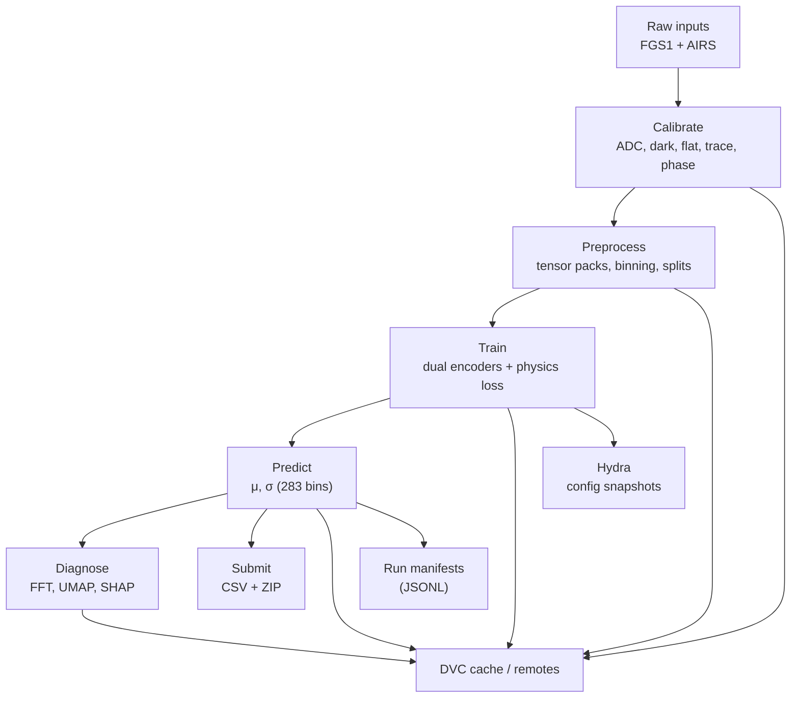
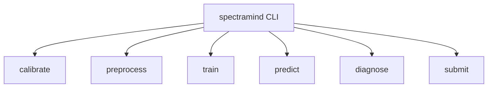
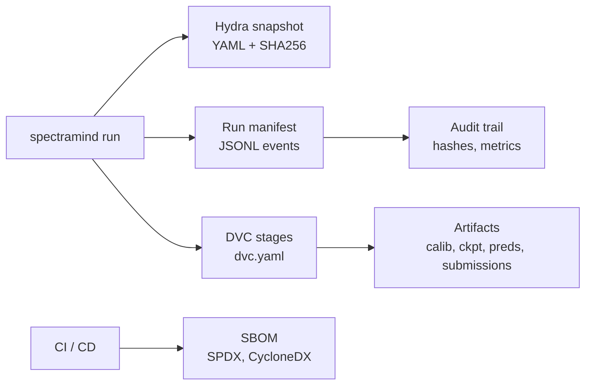
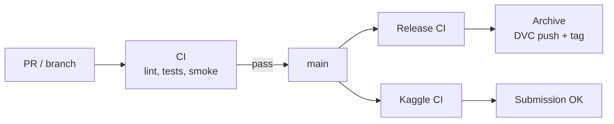
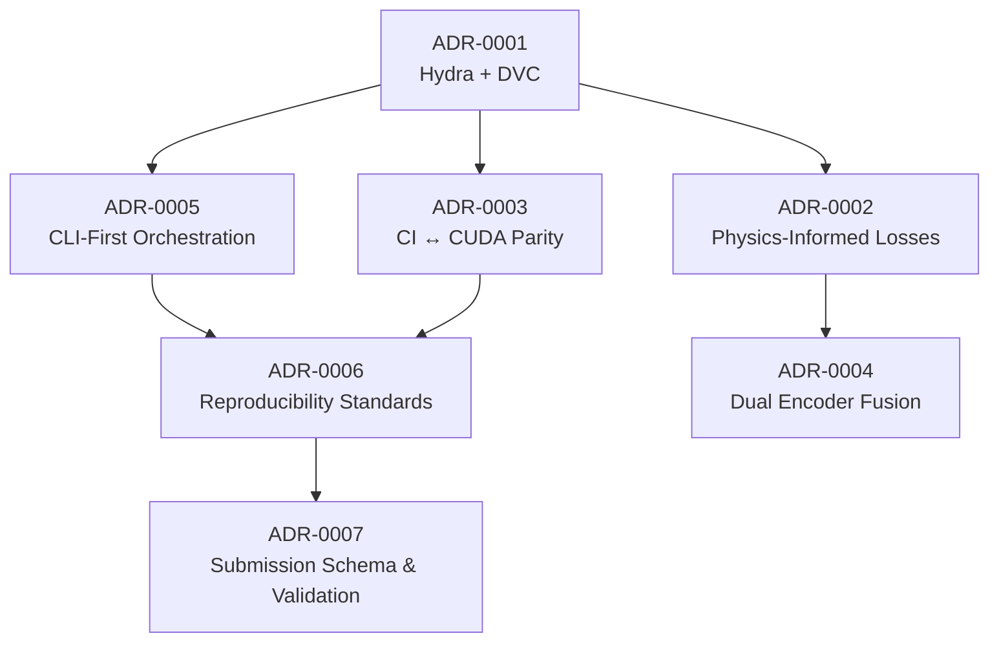

# 🛰️ SpectraMind V50 — Architecture

Mission-grade, **CLI-first, Hydra-driven, DVC-tracked, Kaggle-ready** repository for the NeurIPS 2025 **Ariel Data Challenge**.
Physics-informed, neuro-symbolic pipeline for **dual-sensor fusion** (FGS1 photometry + AIRS spectroscopy) producing calibrated **μ/σ** over **283** spectral bins.

---

## 📐 Design Principles

* **CLI-first UX** — single entrypoint `spectramind` with subcommands: `calibrate`, `preprocess`, `train`, `predict`, `diagnose`, `submit`.
* **Config-as-code** — all runtime parameters live in Hydra YAML; every run snapshots config + hash.
* **Reproducibility** — DVC stages with explicit inputs/outputs; deterministic seeds; cached artifacts.
* **Physics-informed ML** — composite loss (GLL + smoothness + nonnegativity + band coherence); dual encoders (FGS1/AIRS).
* **Explainability & lineage** — FFT, UMAP, SHAP; run manifests; config snapshots; artifact hashes.
* **Governance** — artifact retention & provenance policies (ADR-0009).
* **Kaggle-safe** — offline mode, slim deps, resource-aware presets, submission schema validation.

---

## 🔄 High-Level Pipeline



**Stages (DVC):** `calibrate → preprocess → train → predict → diagnose → submit`.

---

## 🧰 CLI Overview



**Examples**

```bash
# nominal run
spectramind preprocess +preset=nominal
spectramind train data.path=data/train +loss.coherence=1.0

# fast CI preset
spectramind train +defaults='[/profiles/ci]'
```

---

## 📂 Repository Topography

```text
spectramind-v50/
├─ src/spectramind/        # library & CLI entry
│  ├─ cli.py               # Typer app
│  ├─ data/                # datamodules, loaders
│  ├─ calib/               # calibration ops
│  ├─ preprocess/          # tensorization, masks
│  ├─ models/              # fgs1_encoder, airs_encoder, fusion, decoder
│  ├─ losses/              # gll, smoothness, nonneg, coherence
│  ├─ diagnose/            # fft, umap, shap, reports
│  └─ utils/               # io, hashing, schema, seed
├─ configs/                # Hydra configs
│  ├─ train.yaml, predict.yaml, diagnose.yaml, submit.yaml
│  ├─ env/{local,kaggle}.yaml
│  ├─ data/, calib/, model/, training/, loss/, logger/
│  └─ profiles/            # ci, kaggle_gpu, etc.
├─ schemas/                # submission.tableschema.*.json, CSV header templates
├─ dvc.yaml                # pipeline stages
├─ ADR/                    # architecture decision records
├─ .github/workflows/      # CI/CD workflows
├─ assets/diagrams/        # Mermaid pipeline & ADR graphs
└─ outputs/                # DVC-tracked artifacts (cache / remotes)
```

---

## 🧠 Model Architecture

* **FGS1 encoder** — temporal SSM (Mamba or transformer).
* **AIRS encoder** — CNN/GNN hybrid across 283 channels.
* **Fusion** — cross-attention fusion layer.
* **Heads** — heteroscedastic regression producing μ and σ.
* **Loss** — GLL (FGS1 up-weighted) + smoothness + nonnegativity + coherence.

---

## 🧾 Data Lineage & Provenance



* **Snapshots** — commit SHA, Hydra YAML, resolved overrides.
* **Manifests** — JSONL with timing, seed, paths, metric hashes.
* **Artifacts** — tracked via DVC; remote policies defined in ADR-0009.
* **SBOM** — SPDX/CycloneDX produced in release workflow.

---

## 📊 Diagnostics & Explainability

* **FFT** — residual periodicities after prediction.
* **UMAP** — latent clustering of encoded representations.
* **SHAP** — feature attribution at channel / segment level.
* **Lineage reports** — config snapshot + DVC hashes + metrics table.

---

## 📦 Artifact Governance

* **Ephemeral** — CI scratch, debug plots swept automatically.
* **Retained (30 d)** — active checkpoints and diagnostics in DVC cache.
* **Archived** — accepted submissions and tagged checkpoints.
* **Provenance** — every artifact carries config snapshot + git SHA + JSONL manifest.

(See **ADR-0009** for policy specifics and sweeper hooks.)

---

## ⚙️ CI/CD Workflows



* **`ci.yml`** — lint, type-check, unit tests, smoke pipeline.
* **`kaggle_notebook_ci.yml`** — offline submission bundle validation.
* **`release.yml`** — version bump, DVC push, CHANGELOG, SBOM.
* **`sbom-refresh.yml`** — SPDX/CycloneDX refresh.
* **`docs.yml`** — build MkDocs + Mermaid diagrams.

---

## 📚 ADR Index

* **ADR-0001 — Choose Hydra + DVC for Config/Lineage** ✅
* **ADR-0002 — Composite Physics-Informed Losses** ✅
* **ADR-0003 — CI ↔ CUDA Parity** ✅
* **ADR-0004 — Dual Encoder Fusion (FGS1 + AIRS)** ✅
* **ADR-0005 — CLI-First Orchestration** ✅
* **ADR-0006 — Reproducibility Standards** ✅
* **ADR-0007 — Submission Schema & Validation** ✅
* **ADR-0008 — Model Explainability & Diagnostics** 🚧 Planned
* **ADR-0009 — Artifact Retention & Governance** 🚧 Planned

### ADR Dependencies



---

## ✅ Kaggle-Safe Operation

* **Offline mode** — no network assumptions; vendored assets guarded in CI.
* **Slim dependencies** — GPU optional; CPU-only path supported for smoke checks.
* **Submission guardrails** — schema validation, header templates, deterministic CSV writer.
* **Resource-aware presets** — `configs/profiles/ci.yaml`, `configs/preprocess/presets/fast.yaml`.

---

## 🧪 Reproducibility Contract

* **Seeds** fixed and logged.
* **Deterministic dataloaders** with stable splits.
* **Hydra**: resolved configs persisted per run.
* **DVC**: artifacts retrieved by content hash; remotes configured by environment.

---

## 🤝 Contributing

* Use pre-commit; pass lint + type checks locally.
* Keep **Mermaid labels free of `|`**; use `<br/>` for line breaks.
* Update ADRs when decisions change; link PRs in ADR “Consequences”.

---

### Mermaid Rendering Rules (GitHub)

* Prefer `flowchart` with `TD` or `LR`.
* Use simple node IDs (e.g., `A`, `Train_Stage`) and put readable text inside `[" ... "]`.
* Break lines with `<br/>`; avoid tables, backticks, or pipes inside labels.
* One edge per line; no trailing comments on the same line as an edge.

---

*End of document.*
