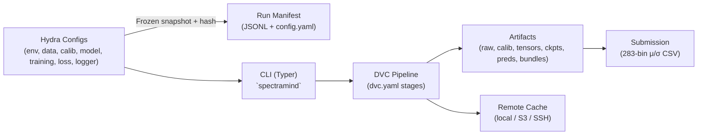

# ADR 0001 — Choose Hydra + DVC for Configuration & Data/Experiment Lineage

* **Status:** ✅ Accepted
* **Date:** 2025-09-06
* **Project:** SpectraMind V50 — NeurIPS 2025 Ariel Data Challenge (FGS1 + AIRS)
* **Tags:** configuration, reproducibility, pipeline, hydra, dvc
* **Owners:** Architecture WG (Lead: Andy Barta), ML/Infra, Data Ops

---

## 1) Context

SpectraMind V50 targets a **mission-grade, fully reproducible pipeline** for multi-sensor fusion (FGS1 photometry + AIRS spectroscopy). The system must:

* Compose complex experiment configs (env / data / calib / model / training / loss / logger) **safely and repeatably** across local, CI, and Kaggle.
* Track **dataset lineage, calibration parameters, and artifacts** across iterative experiments and submissions.
* Provide deterministic re-runs, short audit trails, and human-readable manifests for scientific review.

We require a **configuration framework** and a **data/experiment lineage framework** that:

* Interoperate cleanly with **CLI-first workflows**.
* Scale from laptops → GPU clusters → Kaggle (no internet, ≤9h).
* Enforce **determinism and auditability** without heavy infra.

---

## 2) Decision

Adopt **Hydra** for hierarchical configuration & composition, and **DVC** for artifact tracking and pipeline lineage.

### Hydra

* Unified, hierarchical configs for: `env`, `data`, `calib`, `model`, `training`, `loss`, `logger`.
* Safe composition via `defaults` and CLI overrides (`+env=kaggle`, `+data=nominal`, `+loss=composite`).
* Emit **frozen OmegaConf snapshots** (+ hash + Git rev) per run → reproducible config state.

### DVC

* Encode the pipeline **DAG** (calibration → features → training → prediction → submit) in `dvc.yaml`.
* Track artifacts & intermediates (raw → calibrated → tensors → checkpoints → predictions → bundles).
* Use lightweight DVC remote(s) (local/S3/SSH) to keep Git lean and reproducible.

**Division of labor**

* **Hydra**: defines the **shape & parameters** of an experiment (what to do, with which settings).
* **DVC**: defines and proves **lineage** (what was produced from what, in which order).
* **CLI (`spectramind …`)**: binds both (composes Hydra configs and calls DVC stages/commands).

---

## 3) Drivers

* **Reproducibility** — exact reconstruction from config snapshot + DVC cache/remote.
* **Safety** — remove hidden defaults; fail-loud in CI/Kaggle when inputs are missing or non-deterministic.
* **Iteration speed** — tweak configs, not code; small diffs, quick reviews.
* **Auditability** — per-run JSONL manifest + DVC pipeline graph for short audit trails.
* **Portability** — same run semantics on local, CI, Kaggle (no internet).

---

## 4) Alternatives (and why not)

1. **Pydantic + Makefiles + Git LFS** — brittle, no DAG semantics or artifact provenance.
2. **MLflow + YAML + scripts** — heavier infra; awkward in Kaggle’s offline enclave.
3. **Poetry + Docker only** — good packaging; weak lineage/audit without a DAG+cache layer.

**Hydra + DVC** = the **minimal winning combo** for determinism, lineage, and offline constraints.

---

## 5) Scope

**In-scope:** config tree, pipeline DAG, calibration lineage, artifacts, manifests, CI gates.
**Out-of-scope (for now):** experiment dashboards (W\&B/MLflow), large HPO sweeps, distributed schedulers.

---

## 6) Architecture Overview



---

## 7) Implementation Plan

### Hydra

* Config tree: `configs/{env,data,calib,model,training,loss,logger}` with `defaults` blocks.
* Snapshot each run into `artifacts/runs/<timestamp>_<env>_<profile>/config.yaml` + `config_hash`.
* Guards:

  * Disallow missing keys / untyped nodes (OmegaConf strict mode).
  * Pin seeds and `torch.use_deterministic_algorithms(True)` in CI.
  * Deterministic dataloaders (`num_workers`, `worker_init_fn`, `generator` seeded).

### DVC

* **Stages**: `calibrate`, `features` (if separate), `train`, `predict`, `submit`.
* Enforce `dvc.lock` in CI; `dvc status` must be clean; `dvc repro` succeeds.
* Default remote: `localcache` (repo-relative); optional S3/SSH remotes documented.

---

## 8) Reference Snippets

### Hydra (configs/train.yaml)

```yaml
defaults:
  - env: local
  - data: nominal
  - calib: nominal
  - model: v50
  - training: lightning
  - loss: composite
  - logger: jsonl

seed: 2025
```

### DVC (dvc.yaml)

```yaml
stages:
  calibrate:
    cmd: spectramind calibrate --config-name train +phase=calib
    deps:
      - configs/calib
      - data/raw
    outs:
      - data/calib

  features:
    cmd: spectramind preprocess --config-name train
    deps:
      - configs/data
      - data/calib
    outs:
      - data/tensors

  train:
    cmd: spectramind train --config-name train
    deps:
      - configs/model
      - configs/training
      - data/tensors
    outs:
      - artifacts/ckpts

  predict:
    cmd: spectramind predict --config-name predict
    deps:
      - artifacts/ckpts/best.ckpt
      - data/tensors_eval
      - configs/data
    outs:
      - artifacts/preds

  submit:
    cmd: spectramind submit artifacts/preds --out artifacts/submissions
    deps:
      - artifacts/preds
    outs:
      - artifacts/submissions
```

### Run Manifest (JSONL per run)

```json
{
  "project": "spectramind-v50",
  "run_id": "2025-09-06T21-55-00Z_local_nominal",
  "git_rev": "<sha>",
  "config_hash": "a5b1…",
  "hydra_config": "artifacts/runs/.../config.yaml",
  "stages": ["calibrate","features","train","predict"],
  "artifacts": {
    "ckpt": "artifacts/ckpts/best.ckpt",
    "preds": "artifacts/preds/val.csv"
  }
}
```

---

## 9) Risks & Mitigations

* **Config sprawl** → Lint configs; add `configs/*/ARCHITECTURE.md`; ADR templates for changes.
* **Nondeterminism** → CI determinism job (set seeds, enforce deterministic Torch ops, freeze CuDNN).
* **DVC contention** → Prefer `localcache` with retention policy; document remote quotas.
* **Kaggle runtime** → Provide **fast/strict/nominal** profiles; pack artifacts; avoid heavy post-processing.

---

## 10) Consequences

* ✅ Repeatable experiments verified by CI (configs + DAG + locked artifacts).
* ✅ Short audits (manifest + DVC graph) for paper/leaderboard reviews.
* ❌ Team must adopt YAML discipline; basic Hydra/DVC onboarding required.

---

## 11) CI Compliance Gates

* [ ] `spectramind doctor` passes (env, CUDA, determinism flags).
* [ ] Pre-commit hooks clean (lint/format/type).
* [ ] `dvc status` clean; `dvc repro` succeeds for `-s train`.
* [ ] Run manifest + config snapshot archived per run.
* [ ] Submission schema valid (283 μ + 283 σ columns).

---

## 12) Revisit Triggers

* Kaggle rule changes (runtime, dataset mounts).
* New sensors / calibration modalities.
* Need for experiment tracking UI at scale.
* Shift to distributed training or large HPO.

---

## 13) References

* Repo sources: `configs/*/ARCHITECTURE.md`, `dvc.yaml`, `Makefile`, `bin/spectramind-selftest.sh`.
* Vendor docs: Hydra, DVC, PyTorch determinism notes.
* Related: **ADR 0002 — Physics-Informed Losses**.

---

## 14) FAQ

**Why not Git LFS?**
No DAG semantics; poor cache locality; limited provenance.

**Hydra without DVC?**
You lose artifact lineage and cache reuse; rebuilds get expensive and opaque.

**Quick smoke test?**
`bin/spectramind-selftest.sh` → `+calib=fast +data=debug +env=local`, 1-epoch train, dry-run submit.

**How does this help code review?**
Config diffs are readable; CI proves the pipeline; manifests make runs reproducible and auditable.

---
