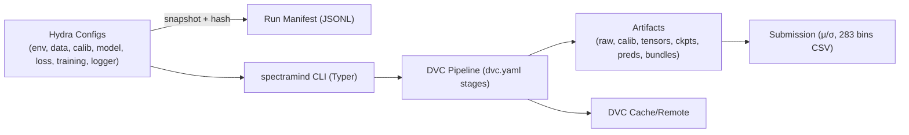

# ADR 0001 — Adopt Hydra + DVC for Config & Data/Experiment Lineage

* **Status:** ✅ Accepted
* **Date:** 2025-09-06
* **Project:** SpectraMind V50 — NeurIPS 2025 Ariel Data Challenge (FGS1 + AIRS)
* **Tags:** configuration, reproducibility, pipeline, hydra, dvc
* **Owners:** Architecture WG (Lead: Andy Barta), ML/Infra, Data Ops

---

## 1. Context

SpectraMind V50 targets a **NASA-grade, neuro-symbolic, reproducible pipeline** for dual-channel fusion (FGS1 photometry + AIRS spectroscopy). The system must:

* Compose **complex hierarchical configs** (`env`, `data`, `calib`, `model`, `loss`, `training`, `logger`) across **local dev, CI, and Kaggle (offline, ≤9h runtime)**.
* Track **dataset lineage, calibration, intermediate tensors, checkpoints, and submissions** under DVC, ensuring reproducibility and cache-aware runs.
* Provide **short audit trails** (JSONL manifests, config hashes) and pass **CI compliance gates** before leaderboard submission.

---

## 2. Decision

Adopt **Hydra** for hierarchical config composition and **DVC** for pipeline/data lineage.

### Hydra

* Unified YAML config tree under `configs/`.
* CLI overrides: `+env=kaggle +data=nominal +loss=composite`.
* Frozen snapshots per run (`artifacts/runs/.../config.yaml` + hash + Git rev).
* Strict OmegaConf mode: no missing/untypeable keys.

### DVC

* Define full DAG in `dvc.yaml`: `calibrate → preprocess → train → predict → diagnose → submit`.
* Track intermediates (`data/interim`, `data/processed/tensors`, `artifacts/ckpts`, `artifacts/preds`).
* Use local DVC cache; optionally sync with S3/SSH remote for heavy artifacts.
* CI enforces `dvc status` clean + `dvc repro` reproducible.

**Division of labor:**

* Hydra → **“what & how to run”**.
* DVC → **“lineage & proof of what was produced from what”**.
* `spectramind` CLI → orchestrates both.

---

## 3. Drivers

* **Reproducibility:** Config snapshots + DVC locks guarantee identical reruns.
* **Iteration speed:** Change YAML, not code; leverage DVC caching.
* **Auditability:** JSONL run manifests + DVC graph as short audit trails.
* **Kaggle readiness:** Works offline, ≤9h, no hidden defaults.

---

## 4. Alternatives (Rejected)

1. **Make + Pydantic + Git LFS** → brittle, no DAG provenance.
2. **MLflow** → infra-heavy, unusable in Kaggle offline.
3. **Docker/Poetry only** → good packaging, weak lineage.

---

## 5. Scope

* ✅ Config tree, DVC pipeline, calibration lineage, artifacts, manifests, CI gates.
* ❌ (for now) dashboards (W\&B/MLflow), large HPO sweeps, distributed schedulers.

---

## 6. Architecture

---

## 7. Implementation Plan

### Hydra

* Config tree in `configs/{env,data,calib,model,training,loss,logger}/`.
* Snapshot to `artifacts/runs/<ts>_<env>/config.yaml`.
* Enforce: strict keys, seeded RNGs, deterministic Torch (`torch.use_deterministic_algorithms(True)`).

### DVC

* Stages (granular, per audit recs):

  * `calibrate`: raw → calibrated.
  * `preprocess`: calibrated → tensors.
  * `train`: tensors → ckpts.
  * `predict`: ckpts + eval tensors → preds.
  * `diagnose`: preds → metrics/plots/HTML.
  * `submit`: preds → Kaggle CSV/zip.
* Metrics: validation loss, GLL score logged as `dvc metrics`.

---

## 8. Risks & Mitigations

* **Config sprawl:** Guard with `configs/*/ARCHITECTURE.md` + lint.
* **Nondeterminism:** CI job enforces determinism (seeds, Torch flags).
* **DVC overhead:** Default `localcache`; remote quotas optional.
* **Kaggle runtime:** Pre-package calibrated outputs & checkpoints as Kaggle Datasets.

---

## 9. Consequences

* ✅ Repeatable experiments, CI-verified.
* ✅ Audit-ready manifests + DVC graphs.
* ❌ Higher YAML discipline required (onboarding cost).

---

## 10. CI Compliance Gates

* [ ] `spectramind doctor` passes (env, CUDA, determinism).
* [ ] Pre-commit hooks clean.
* [ ] `dvc status` clean, `dvc repro` works for `-s train`.
* [ ] Config snapshot + manifest archived.
* [ ] Submission schema (283 μ + 283 σ) valid.

---

## 11. Revisit Triggers

* Kaggle rule/runtime changes.
* New sensors/calibration modalities.
* Need for large-scale HPO or experiment dashboards.

---

## 12. References

* Repo designs.
* Kaggle data linking.
* Audit gaps & recs.
* Physics-informed modeling.

---

✅ This aligns with both your draft and the **SpectraMind V50 production repo blueprint**, ensuring Hydra + DVC are our backbone for reproducibility and Kaggle-readiness.

---
