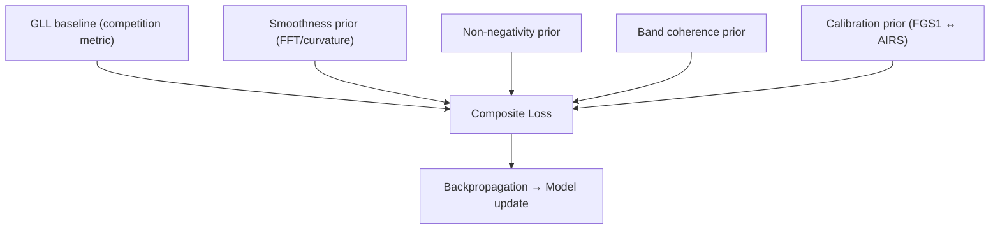

# ADR 0002 — Physics-Informed Losses

* **Status:** ✅ Accepted
* **Date:** 2025-09-06
* **Project:** SpectraMind V50 — NeurIPS 2025 Ariel Data Challenge
* **Tags:** loss, physics-informed, reproducibility, exoplanet, astrophysics
* **Owners:** ML/Physics WG (Lead: Andy Barta), Spectroscopy Science Council

---

## 1. Context

The Ariel challenge requires predicting **283-bin transmission spectra** (mean μ and uncertainty σ per bin) with calibrated uncertainties.

* The official metric is **Gaussian Log-Likelihood (GLL)**, where the **FGS1 white-light bin is ≈58× weighted** relative to a single AIRS bin.
* Prior experience (2024) exposed common failure modes:

  * **Overconfident predictions** → large penalties under GLL.
  * **Physically invalid spectra** → negative depths, jagged high-frequency artifacts.
* Our repository supports modular loss configs under `configs/loss/`, with per-term toggles.
* Physics-informed priors (smoothness, positivity, band-structure coherence, cross-channel calibration) reflect astrophysical reality and improve OOD generalization.

Without these constraints, models can over-optimize GLL while producing spectra that are **scientifically implausible**.

---

## 2. Decision

Adopt a **composite physics-informed loss**:

$$
\mathcal{L} \;=\; \mathcal{L}_{\text{GLL}}
\;+\; \lambda_{\text{smooth}} \,\mathcal{L}_{\text{smooth}}
\;+\; \lambda_{\text{nonneg}} \,\mathcal{L}_{\text{nonneg}}
\;+\; \lambda_{\text{band}} \,\mathcal{L}_{\text{band}}
\;+\; \lambda_{\text{calib}} \,\mathcal{L}_{\text{calib}}
$$

### Components (at a glance)

* **$\mathcal{L}_{\text{GLL}}$** — dataset GLL with **FGS1 weighting**; exact match to competition scoring.
* **$\mathcal{L}_{\text{smooth}}$** — penalize curvature / high-frequency content in μ (second-difference / spectral-power).
* **$\mathcal{L}_{\text{nonneg}}$** — barrier/hinge enforcing **μ ≥ 0** (transit depths non-negative).
* **$\mathcal{L}_{\text{band}}$** — **band coherence** within contiguous molecular regions (e.g., H₂O, CO₂, CH₄) to avoid unphysical bin-to-bin oscillations.
* **$\mathcal{L}_{\text{calib}}$** — cross-channel **FGS1 ↔ AIRS** alignment to stabilize shared baseline.

All $\lambda$ hyperparameters are tunable via Hydra in `configs/loss/composite.yaml`.

---

## 3. Architecture



* Loss terms implemented under `src/spectramind/losses/*.py`.
* Configured via Hydra (`configs/loss/*.yaml`).
* Each term is logged **per step** and aggregated **per epoch** into JSONL/W\&B; diagnostics written to `artifacts/reports/`.

---

## 4. Design details

### 4.1 Gaussian Log-Likelihood (baseline)

Compute the mean negative log-likelihood with **FGS1 channel up-weighting** (≈58× vs a single AIRS bin), matching competition evaluation exactly. Provide both **batch** and **per-sample** reductions to support calibration/diagnostics.

### 4.2 Smoothness prior $\mathcal{L}_{\text{smooth}}$

Two equivalent implementations are allowed (selectable in config):

* **Curvature penalty (discrete 2nd difference)**
  $\mathcal{L}_{\text{smooth}} = \sum_b \big(\mu_{b-1} - 2\mu_b + \mu_{b+1}\big)^2$
* **FFT-domain high-frequency power** with a windowed high-pass mask.

FFT/curvature choice, frequency cutoff, and normalization are configured under `configs/loss/smoothness.yaml`.

### 4.3 Non-negativity prior $\mathcal{L}_{\text{nonneg}}$

Prefer a **soft hinge** barrier on the **final μ** after activation:
$\mathcal{L}_{\text{nonneg}} = \sum_b \text{ReLU}(-\mu_b)^2$
(Optionally: transform head with `softplus` to enforce hard non-negativity, then set $\lambda_{\text{nonneg}}=0$.)

### 4.4 Band coherence prior $\mathcal{L}_{\text{band}}$

Encourage **local consistency** inside physics-motivated wavelength bands (H₂O, CO₂, CH₄ windows). Two options:

* **Local TV-like penalty** within each band: $\sum_{b \in \text{band}} |\mu_{b+1} - \mu_b|$
* **Band-level shape consistency** via low-rank fit (optional): penalize large residuals from a bandwise smooth template.

Band definitions live in config (`configs/loss/band_coherence.yaml`) and may be swapped/extended.

### 4.5 Calibration prior $\mathcal{L}_{\text{calib}}$

Align AIRS spectrum with white-light FGS1 depth to stabilize shared baseline and reduce channel drift. Simple form:

$$
\mathcal{L}_{\text{calib}} \;=\; \big(\overline{\mu}_{\text{AIRS}} - \mu_{\text{FGS1}}\big)^2
$$

Use **annealing** (e.g., warm-up to $\lambda_{\text{calib}}$ over first N epochs) to avoid early over-constraint.

---

## 5. Consequences

### ✅ Pros

* **OOD robustness**: reduces overconfidence and ringing; better generalization.
* **Scientific credibility**: smooth, non-negative, band-coherent spectra.
* **Modular & ablatable**: priors toggleable per Hydra; easy to sweep $\lambda$s.
* **Reproducible**: integrated with Hydra/DVC; per-term logs + reports.

### ⚠️ Cons

* Over-regularization risk (suppressed features).
* $\lambda$ sweeps add compute.
* Priors must be justified (avoid leaderboard over-fitting).

---

## 6. Implementation Plan

1. **Code**
   `src/spectramind/losses/`:

* `gll.py`: exact competition metric (FGS1 weight).
* `smoothness.py`: curvature + FFT variants.
* `nonneg.py`: hinge barrier (`ReLU(-μ)^2`) + optional hard `softplus` head.
* `band_coherence.py`: TV-like and template variants; band catalogs in YAML.
* `calibration.py`: FGS1↔AIRS alignment + anneal schedule.
* `composite.py`: loss registry + weighted sum, per-term logging.

2. **Configs**
   `configs/loss/`:

* `composite.yaml`: default $\lambda$s and toggles, log granularity.
* `smoothness.yaml`, `nonneg.yaml`, `band_coherence.yaml`, `calibration.yaml`: per-term options.
* `bands/*.yaml`: molecule-band definitions.

3. **Logging & Reports**

* Per-term scalars to JSONL/W\&B each step/epoch.
* **Diagnostics**: FFT spectra, UMAP embeddings of per-sample residuals, coverage and calibration plots in `artifacts/reports/`.

4. **Validation**

* **Ablations**: +smooth, +nonneg, +band, +calib; report ΔGLL/Δcoverage.
* **OOD**: synthetic/random atmospheres; confirm priors don’t hallucinate features.

---

## 7. Risks & Mitigations

| Risk                             | Mitigation                                                     |
| -------------------------------- | -------------------------------------------------------------- |
| Over-constraining (underfit)     | Start with small $\lambda$; anneal; ablation checkpoints.      |
| Priors overfit to challenge      | Test on synthetic OOD (randomized bands/levels).               |
| Compute cost of $\lambda$ sweeps | Early stopping + Bayesian search over $\lambda$ grid.          |
| FGS1/AIRS calibration mismatch   | **Anneal** $\lambda_{\text{calib}}$; only on stable epochs N+. |

---

## 8. Compliance Gates (CI)

* [ ] Unit tests: numerical stability; non-negativity enforcement; curvature/FFT equivalence.
* [ ] Each prior independently toggleable via Hydra (smoke tests).
* [ ] JSONL/W\&B include **per-term** breakdown and totals.
* [ ] Diagnostic plots saved under `artifacts/reports/`.
* [ ] Kaggle runtime guardrails: **no network** during training; logs compact.

---

## 9. References

* Ariel Challenge documentation and scoring (GLL; FGS1 weighting).
* 2024 challenge learnings on smoothness/non-negativity and generalization.
* ADR 0001 (Hydra + DVC), ADR 0003 (CI↔CUDA determinism).
* Spectroscopy diagnostics (FFT/UMAP, band coherence).
* JWST WASP-39b: CO₂ & SO₂ detections (motivation for band regions and smoothness).

---

### Default $\lambda$s (initial suggestion)

```yaml
# configs/loss/composite.yaml
lambda:
  smooth:  1e-3
  nonneg:  1e-2
  band:    5e-4
  calib:   1e-3
anneal:
  calib:
    start_epoch: 3
    end_epoch: 10
    max_weight: ${lambda.calib}
```

These are deliberately conservative to **avoid early underfitting**. Sweep ranges will be documented alongside ablation results.

---
