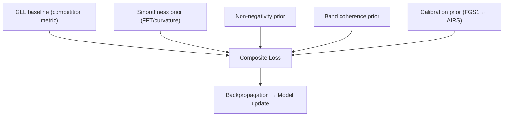

# ADR 0002 — Physics-Informed Losses

* **Status:** ✅ Accepted
* **Date:** 2025-09-06
* **Project:** SpectraMind V50 — NeurIPS 2025 Ariel Data Challenge
* **Tags:** loss, physics-informed, reproducibility, exoplanet, astrophysics
* **Owners:** ML/Physics WG (Lead: Andy Barta), Spectroscopy Science Council

---

## 1. Context

The Ariel challenge requires predicting **283-bin transmission spectra (μ & σ)** with calibrated uncertainties.

* The metric is **Gaussian Log-Likelihood (GLL)**, where the **FGS1 white-light bin is \~58× weighted**.
* Past leaderboard experience (2024) showed failure modes:

  * **Overconfident predictions** → huge penalties under GLL.
  * **Physically invalid spectra** → negative depths, jagged noise spikes.
* Our repo supports modular Hydra configs under `configs/loss/`.
* Physics priors (smoothness, positivity, band coherence) align with astrophysical reality and ensure outputs generalize beyond leaderboard optimization.

Without these, the model may **“game the metric”** but produce spectra that are unpublishable scientifically.

---

## 2. Decision

Adopt a **composite physics-informed loss**:

$$
\mathcal{L} = \mathcal{L}_{GLL}
+ \lambda_{smooth} \mathcal{L}_{smooth}
+ \lambda_{nonneg} \mathcal{L}_{nonneg}
+ \lambda_{band} \mathcal{L}_{band}
+ \lambda_{calib} \mathcal{L}_{calib}
$$

### Components

* **\$\mathcal{L}\_{GLL}\$** — Gaussian log-likelihood (competition metric, includes FGS1 weighting).
* **\$\mathcal{L}\_{smooth}\$** — penalizes high-frequency curvature (checked via FFT).
* **\$\mathcal{L}\_{nonneg}\$** — ensures all transit depths ≥ 0.
* **\$\mathcal{L}\_{band}\$** — band coherence across molecular features (H₂O, CO₂, CH₄).
* **\$\mathcal{L}\_{calib}\$** — aligns AIRS spectral baseline with FGS1 white-light depth.

All λ hyperparameters tunable in `configs/loss/composite.yaml`.

---

## 3. Architecture

* Loss terms in `src/spectramind/losses/*.py`.
* Configurable via Hydra (`configs/loss/*.yaml`).
* Per-term logging in JSONL/W\&B + diagnostic reports (`artifacts/reports/`).

---

## 4. Consequences

### ✅ Pros

* Improves robustness under **OOD regimes**.
* Guarantees **scientifically credible spectra** (smooth, nonnegative, coherent).
* Modular: easy to toggle priors, sweep λ, or run ablations.
* Reinforces reproducibility via Hydra/DVC integration.

### ⚠️ Cons

* Risk of **underfitting** if λ too strong.
* Requires **λ sweeps** (adds compute).
* Priors must be **justified scientifically** (avoid leaderboard over-engineering).

---

## 5. Implementation Plan

1. Loss modules → `src/spectramind/losses/{smoothness,nonneg,band_coherence,calibration,composite}.py`.
2. Hydra configs → `configs/loss/{smoothness.yaml,nonneg.yaml,band_coherence.yaml,calibration.yaml,composite.yaml}`.
3. Logging → log all loss terms per step in JSONL + W\&B.
4. Diagnostics → FFT/UMAP plots to validate smoothness and coherence.
5. Validation → ablation runs proving incremental contribution of each term.

---

## 6. Risks & Mitigations

| Risk                             | Mitigation                                                |
| -------------------------------- | --------------------------------------------------------- |
| Over-constraining (underfit)     | Start with small λ, increase gradually; ablation studies. |
| Overfitting priors to challenge  | Validate on synthetic OOD spectra.                        |
| Compute cost of λ sweeps         | Use early stopping + Bayesian search.                     |
| Calibration mismatch (FGS1/AIRS) | Anneal λ\_calib over epochs.                              |

---

## 7. Compliance Gates (CI)

* [ ] Unit tests: stability + nonnegativity enforcement.
* [ ] Each prior toggleable via Hydra.
* [ ] JSONL logs include per-loss breakdown.
* [ ] Diagnostic plots saved under `artifacts/reports/`.
* [ ] Kaggle guardrails: no internet calls during training.

---

## 8. References

* NeurIPS 2025 Ariel Challenge docs.
* Lessons from 2024 challenge.
* SpectraMind repo ADR 0001 (Hydra + DVC).
* Spectroscopy constraints & diagnostics.
* JWST WASP-39b: CO₂ & SO₂ detection.

---
