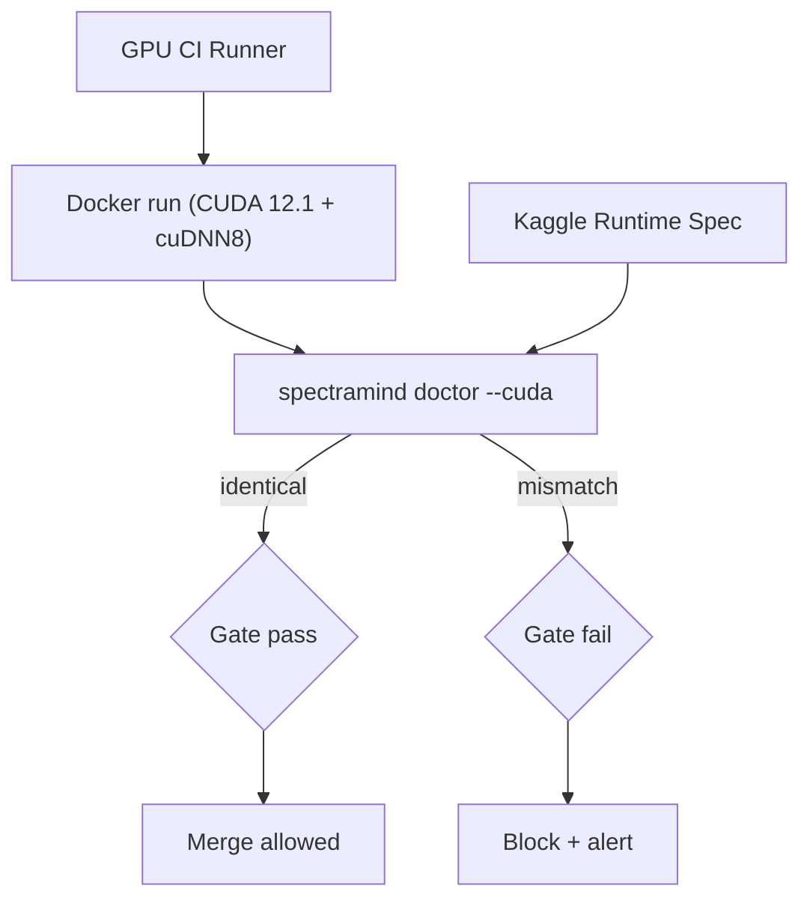

# ADR 0003 — CI ↔ CUDA Parity

* **Status:** ✅ Accepted
* **Date:** 2025-09-06
* **Project:** SpectraMind V50 — NeurIPS 2025 Ariel Data Challenge
* **Tags:** ci, cuda, reproducibility, environment, testing
* **Owners:** Infra WG (Lead: Andy Barta), ML/Infra, CI/CD Ops

---

## 1) Context

SpectraMind V50 trains **GPU-accelerated PyTorch** models for dual-channel fusion (FGS1 + AIRS). Our runs must behave **identically** across:

* **Local dev** (heterogeneous drivers),
* **CI** (GPU runners),
* **Kaggle** (fixed CUDA runtime, offline, 9h wallclock).

Without strict parity, kernel selection (cuDNN heuristics, TF32), PTX→SASS JIT, or minor wheel drift can cause **“green in CI, broken on Kaggle”** and subtle non-determinism.

---

## 2) Decision

Enforce **strict CUDA parity with Kaggle**:

1. **Pin the torch/CUDA trio** to Kaggle’s runtime (e.g. `torch==2.3.1+cu121`, `torchvision==0.18.1+cu121`, `torchaudio==2.3.1+cu121`, cuDNN 8.x).
2. **Run CI in a pinned CUDA container** mirroring Kaggle (`nvidia/cuda:12.1.105-cudnn8-runtime-ubuntu22.04`).
3. **Gate merges** with a CUDA parity check:

* `spectramind doctor --cuda --fail-on-mismatch` compares `torch.__version__`, `torch.version.cuda`, `torch.backends.cudnn.version()`, `nvidia-smi`, and `/usr/local/cuda/version*`; fails CI on mismatch.

Also **standardize determinism knobs** across envs (see §7.4).

---

## 3) Drivers

* **Reproducibility**: identical kernels/math paths in CI & Kaggle.
* **Safety**: fail early on environment drift.
* **Velocity**: eliminate env bugs late in the cycle.
* **Auditability**: run manifests include torch/CUDA/cuDNN triplet.

---

## 4) Alternatives

| Option                           | Pros             | Cons                              |
| -------------------------------- | ---------------- | --------------------------------- |
| Loose pinning (`2.3.*`, `cu12*`) | Less maintenance | Breaks on Kaggle hot-patches      |
| CUDA matrix (11.8/12.1/12.4)     | Wider coverage   | Expensive, not Kaggle-aligned     |
| Rely on upstream defaults        | Simpler          | Wheels drift vs Kaggle base image |

**Chosen:** strict pinning to Kaggle.

---

## 5) Scope

**In-scope**: pinned CUDA container, `cuda-parity` CI job, `spectramind doctor --cuda`, run-manifest fingerprints.
**Out-of-scope**: ROCm/CPU tracks (separate ADR), legacy CUDA matrices.

---

## 6) Architecture



---

## 7) Implementation Plan

### 7.1 Dockerfile (CI image)

```Dockerfile
# ./Dockerfile.ci.cuda
FROM nvidia/cuda:12.1.105-cudnn8-runtime-ubuntu22.04

ENV DEBIAN_FRONTEND=noninteractive \
    PIP_NO_CACHE_DIR=1 PYTHONDONTWRITEBYTECODE=1 FORCE_CUDA=1 \
    LC_ALL=C.UTF-8 LANG=C.UTF-8

RUN apt-get update && apt-get install -y --no-install-recommends \
      python3 python3-pip python3-dev python3-venv \
      git curl ca-certificates build-essential jq pciutils \
  && rm -rf /var/lib/apt/lists/*

RUN update-alternatives --install /usr/bin/python python /usr/bin/python3 1 && \
    python -m pip install --upgrade pip setuptools wheel

# Match Kaggle
RUN pip install --extra-index-url https://download.pytorch.org/whl/cu121 \
      torch==2.3.1+cu121 torchvision==0.18.1+cu121 torchaudio==2.3.1+cu121

COPY requirements-kaggle.txt /tmp/requirements-kaggle.txt
RUN pip install -r /tmp/requirements-kaggle.txt || true

RUN useradd -ms /bin/bash runner
USER runner
WORKDIR /workspace

CMD python - <<'PY'
import torch, sys
print("Torch:", torch.__version__, "CUDA:", torch.version.cuda)
print("cuDNN:", torch.backends.cudnn.version())
print(sys.version)
PY
```

### 7.2 CI Job (GitHub Actions excerpt)

```yaml
jobs:
  cuda-parity:
    name: CUDA Parity (Kaggle)
    runs-on: ubuntu-22.04
    container:
      image: ghcr.io/your-org/spectramind-ci-cuda:12.1.105
      options: --gpus all --ipc=host
    steps:
      - uses: actions/checkout@v4
      - name: Install package
        run: pip install -e .
      - name: Doctor CUDA parity
        run: spectramind doctor --cuda --fail-on-mismatch --emit-json parity_report.json
      - name: Upload parity report
        if: always()
        uses: actions/upload-artifact@v4
        with:
          name: cuda-parity
          path: parity_report.json
```

> **Note:** Use **self-hosted NVIDIA runners** (or GHES) for `--gpus all`. If no GPU: mark the job “required but skippable” and require a GPU run before merge.

### 7.3 CLI parity command (excerpt)

```python
# src/spectramind/cli/doctor.py
@app.command("doctor")
def doctor_cuda(cuda: bool = typer.Option(False, "--cuda"),
                fail_on_mismatch: bool = typer.Option(False, "--fail-on-mismatch"),
                emit_json: str = typer.Option("", "--emit-json")):
    import torch, json, platform, subprocess, os, sys
    # gather versions …
    # compare to target (torch 2.3.1+cu121, CUDA 12.1, cuDNN 8.x) …
    # write JSON + exit(1) on mismatch when requested
```

### 7.4 Determinism policy

```python
# src/spectramind/utils/determinism.py
def enforce(seed: int = 1337):
    os.environ.setdefault("PYTHONHASHSEED", str(seed))
    os.environ.setdefault("CUBLAS_WORKSPACE_CONFIG", ":4096:8")
    os.environ.setdefault("NVIDIA_TF32_OVERRIDE", "0")  # disable TF32
    random.seed(seed); np.random.seed(seed); torch.manual_seed(seed); torch.cuda.manual_seed_all(seed)
    torch.use_deterministic_algorithms(True)
    torch.backends.cudnn.deterministic = True
    torch.backends.cudnn.benchmark = False
    if hasattr(torch, "set_float32_matmul_precision"):
        torch.set_float32_matmul_precision("highest")
```

### 7.5 Run manifest augmentation

Every run writes CUDA fingerprints to `artifacts/run_manifest.json`:

```json
{
  "env": {
    "torch": "2.3.1+cu121",
    "torch_cuda": "12.1",
    "cudnn": 8905,
    "python": "3.10.14",
    "nvidia_smi": "Driver Version: 535.161.08 CUDA Version: 12.2",
    "cuda_version_txt": "CUDA Version 12.1.1"
  },
  "seeds": 1337,
  "determinism": { "cudnn_deterministic": true, "cudnn_benchmark": false }
}
```

---

## 8) Risks & Mitigations

| Risk                          | Mitigation                                                                                |
| ----------------------------- | ----------------------------------------------------------------------------------------- |
| Kaggle silently updates image | Weekly CI job diffs Kaggle specs vs our pinned JSON; open alert PR to bump pins.          |
| No GPU on CI runner           | Required-but-skippable parity step; separate “GPU required” label before merge to `main`. |
| Container build overhead      | Buildx cache to GHCR; reuse image; minimize extras in `requirements-kaggle.txt`.          |
| cuDNN patch-level drift       | Gate on **major** (8.x) and optionally minor; bump pins in one PR when Kaggle updates.    |
| `nvcc` not present in runtime | Accept absence; rely on `torch.version.cuda` + `/usr/local/cuda/version*` + `nvidia-smi`. |

---

## 9) Consequences

* ✅ CI mirrors Kaggle; no last-minute env surprises.
* ✅ Deterministic training & evaluation (within PyTorch limits).
* ❌ Slightly higher maintenance: version bumps update Dockerfile + parity + requirements.

---

## 10) Compliance Gates (CI)

* [ ] `spectramind doctor --cuda --fail-on-mismatch` **passes**.
* [ ] `torch.__version__ == 2.3.1+cu121` (example).
* [ ] `torch.version.cuda` startswith `12.1`.
* [ ] `torch.backends.cudnn.version()` major == 8.
* [ ] Run manifest contains torch/CUDA/cuDNN fingerprints.

---

## 11) Revisit Triggers

* Kaggle publishes a new competitions base image.
* NVIDIA policy shifts (TF32 defaults, cuDNN determinism).
* Competition adds CPU-only/ROCm tracks.

---

## 12) References

* Kaggle competitions base images & release notes.
* PyTorch CUDA wheel matrix (2.3.1 / cu121).
* Repo: `Dockerfile.ci.cuda`, `.github/workflows/ci.yml`, `spectramind doctor`, `requirements-kaggle.txt`.

---

### Appendix A — Makefile targets

```makefile
.PHONY: image.push cuda.parity

image.push:
	docker buildx build -f Dockerfile.ci.cuda \
	  -t ghcr.io/your-org/spectramind-ci-cuda:12.1.105 --push .

cuda.parity:
	spectramind doctor --cuda --fail-on-mismatch --emit-json parity_report.json
	jq . parity_report.json
```

### Appendix B — requirements-kaggle.txt (pinned)

```
--extra-index-url https://download.pytorch.org/whl/cu121
torch==2.3.1+cu121
torchvision==0.18.1+cu121
torchaudio==2.3.1+cu121
numpy==1.26.4
pandas==2.2.2
scipy==1.13.1
typer==0.12.3
rich==13.7.1
jsonschema==4.23.0
```

### Appendix C — Kaggle bootstrap (notebook)

```bash
%run bin/kaggle-boot.sh
!python -c "import torch; print(torch.__version__, torch.version.cuda, __import__('torch').backends.cudnn.version())"
```
