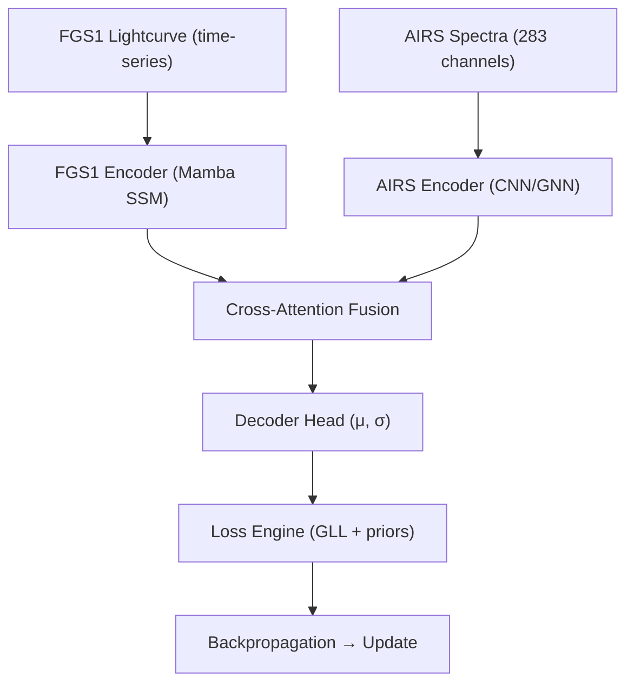

# ADR 0004 — Dual Encoder Fusion (FGS1 + AIRS)

* **Status:** ✅ Accepted
* **Date:** 2025-09-07
* **Project:** SpectraMind V50 — NeurIPS 2025 Ariel Data Challenge
* **Tags:** model, architecture, fusion, reproducibility
* **Owners:** ML/Architecture WG (Lead: Andy Barta), Infra WG, Science Council

---

## 1) Context

The challenge requires predicting **283-bin exoplanet transmission spectra (μ/σ)** from dual inputs:

* **FGS1 photometry (broadband lightcurve)** — high precision white-light flux, sensitive to transit depth.
* **AIRS spectroscopy (283 channels)** — noisy low-resolution spectral images with per-channel systematics.

Scientific motivation:

* FGS1 captures the **global transit depth & timing** but no spectral features.
* AIRS provides **molecular features (H₂O, CO₂, SO₂, CH₄, …)** but suffers from instrument noise.

Fusion of these modalities is **non-optional**: each compensates for the other. A single-channel solution underperforms on OOD and leaderboard metrics.

---

## 2) Decision

Adopt a **dual-encoder fusion model**:

* **FGS1 Encoder** = **Mamba SSM** (state-space model) specialized for 1D time-series (long-context, stable, efficient).
* **AIRS Encoder** = **GNN/CNN hybrid** extracting local + relational structure across wavelength bins.
* **Fusion Module** = **Cross-attention block** aligning photometric + spectroscopic embeddings.
* **Decoder Head** = **heteroscedastic regressor** → outputs μ (mean spectrum) & σ (uncertainty) optimized via composite loss (see ADR-0002).

All components are modular under `src/spectramind/models/`.

---

## 3) Drivers

* **Physical fidelity** — FGS1 baseline anchors AIRS channel predictions, reducing calibration drift.
* **Leaderboard metric** — Gaussian log-likelihood punishes overconfidence; heteroscedastic decoder aligns with metric.
* **Generalization** — cross-attention allows robust alignment across domains (noisy AIRS vs stable FGS1).
* **Reproducibility** — Hydra configs declare encoder/decoder separately (`configs/model/{fgs1_encoder,airs_encoder,fusion,decoder}.yaml`).

---

## 4) Architecture

---

## 5) Alternatives

| Option                                     | Pros                                            | Cons                                        |
| ------------------------------------------ | ----------------------------------------------- | ------------------------------------------- |
| **Single AIRS encoder only**               | Simpler, less compute                           | Fails to anchor calibration; overfits noise |
| **Naive concat (FGS1 + AIRS)**             | Easy to implement                               | Ignores alignment; worse inductive bias     |
| **Late fusion (separate preds, averaged)** | Some redundancy                                 | Discards joint signal; incoherent σ         |
| **Chosen: Cross-attention dual encoder**   | Best physical alignment, leaderboard robustness | More complex; needs tuning                  |

---

## 6) Implementation Plan

1. **Encoders**

   * `src/spectramind/models/fgs1_mamba.py`
   * `src/spectramind/models/airs_gnn.py`

2. **Fusion**

   * `src/spectramind/models/fusion_xattn.py`

3. **Decoder**

   * `src/spectramind/models/decoder_head.py`

4. **Hydra configs**

   * `configs/model/fgs1_encoder.yaml`
   * `configs/model/airs_encoder.yaml`
   * `configs/model/fusion.yaml`
   * `configs/model/decoder.yaml`

5. **Training hooks**

   * Composite loss integration (`src/spectramind/losses/composite.py`).
   * Ensure per-channel σ strictly ≥ 0 (nonnegativity prior).

---

## 7) Risks & Mitigations

| Risk                                             | Mitigation                                              |
| ------------------------------------------------ | ------------------------------------------------------- |
| Training instability (cross-attention too heavy) | Warm-start with frozen AIRS encoder, unfreeze gradually |
| Overfitting AIRS noise                           | λ priors (smoothness, band coherence) from ADR-0002     |
| Compute budget (Kaggle 9h)                       | Efficient SSM (Mamba), mixed precision training         |
| Mis-calibration of uncertainties                 | Post-hoc calibration + diagnostic FFT/UMAP              |

---

## 8) Consequences

* ✅ Physics-informed, dual-channel integration = better leaderboard & credibility.
* ✅ Encoders modular, easily swappable.
* ✅ Matches scientific motivation (FGS1 anchors global, AIRS provides molecular features).
* ❌ More moving parts; CI must include integration tests.

---

## 9) Compliance Gates (CI)

* [ ] Model builds from Hydra configs with both encoders + fusion.
* [ ] JSONL metrics log includes per-encoder contributions.
* [ ] Unit tests for fusion block shape alignment.
* [ ] Diagnostics (FFT/UMAP, SHAP) validate fused embeddings.
* [ ] Submission CSV matches schema (283 μ + 283 σ).

---

## 10) References

* SpectraMind Repository Design Docs
* Exoplanet spectroscopy challenges
* JWST WASP-39b detection of SO₂ and CO₂
* ADR-0001 (Hydra + DVC), ADR-0002 (Physics Losses), ADR-0003 (CI ↔ CUDA Parity)

---
