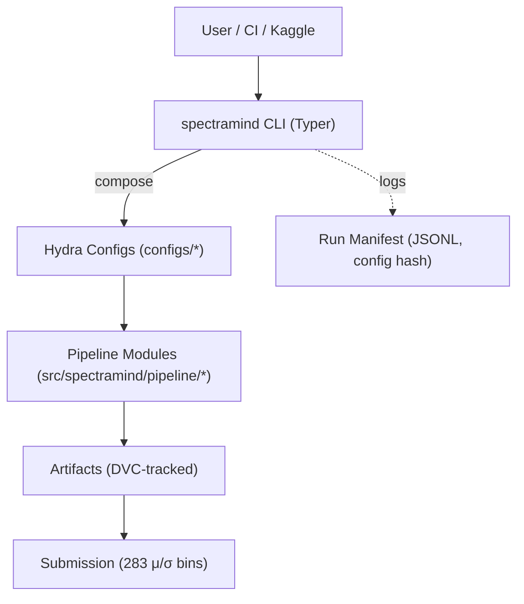

# ADR 0005 — CLI-First Orchestration

* **Status:** ✅ Accepted
* **Date:** 2025-09-07
* **Project:** SpectraMind V50 — NeurIPS 2025 Ariel Data Challenge
* **Tags:** cli, orchestration, hydra, reproducibility, ux
* **Owners:** Infra WG (Lead: Andy Barta), ML/Infra, Tooling WG

---

## 1) Context

SpectraMind V50 is a **mission-grade AI pipeline** with multiple stages:
`calibrate → train → predict → diagnose → submit`.

Challenges faced before ADR-0005:

* Scripts scattered (`train.py`, `predict.py`, `notebooks/`) → inconsistent UX.
* Hydra configs powerful but hard to invoke consistently without a wrapper.
* Kaggle runtime requires **internet-disabled**, single-command reproducibility.
* CI/CD jobs (GitHub Actions) need uniform entrypoints to run all stages safely.

We require a **single, discoverable CLI** that exposes *all* pipeline functions with reproducible defaults.

---

## 2) Decision

Adopt a **CLI-first orchestration layer**:

* **Typer** (Python 3.10+ → modern, type-hinted, auto-docs).
* **Single entrypoint:** `spectramind` → with subcommands for all stages.
* **Hydra integration:** every command accepts `--config-name` + overrides (`+foo=bar`).
* **Rich UX:** `--help`, tab completion, colorized errors (via `rich`).
* **Determinism guardrails:** CLI enforces seeds, strict Hydra mode, Kaggle runtime safety.

---

## 3) Drivers

* **Reproducibility** — one entrypoint across local, CI, Kaggle.
* **Velocity** — quick experiments via Hydra overrides (`spectramind train +loss=nonneg`).
* **Auditability** — every invocation logs JSONL manifests with config hash.
* **Safety** — disallow hidden defaults; fail-loud in CI.
* **User UX** — discoverable, consistent, easy to teach to collaborators.

---

## 4) Alternatives

| Option                                           | Pros                             | Cons                                   |
| ------------------------------------------------ | -------------------------------- | -------------------------------------- |
| Ad-hoc Python scripts (`train.py`, `predict.py`) | Simple                           | Fragmented, inconsistent               |
| Bash wrappers around Hydra                       | Easy CI                          | Fragile, poor UX, limited portability  |
| Full workflow managers (Airflow, Prefect)        | Powerful                         | Overkill, heavy infra, not Kaggle-safe |
| **Chosen: Typer CLI + Hydra**                    | Lightweight, modern, Kaggle-safe | Requires disciplined design            |

---

## 5) Architecture

---

## 6) Implementation Plan

1. **CLI module:** `src/spectramind/cli.py`

   * Subcommands: `calibrate`, `train`, `predict`, `diagnose`, `submit`.
   * Delegates to pipeline `run()` functions (`src/spectramind/pipeline/*.py`).

2. **Hydra binding:**

   * `--config-name` and `+overrides`.
   * Snapshot configs to `artifacts/runs/.../config.yaml`.

3. **UX polish:**

   * Rich-powered error messages, colored help tables.
   * Auto-completion enabled in bash/zsh/fish.

4. **Compliance hooks:**

   * Every command writes run manifest (`events.jsonl`).
   * Kaggle mode disables internet + checks runtime parity.

---

## 7) Risks & Mitigations

| Risk                           | Mitigation                                                   |
| ------------------------------ | ------------------------------------------------------------ |
| CLI bloat (too many flags)     | Hydra configs keep CLI slim; encourage overrides             |
| CI vs local drift              | Pin Hydra/OmegaConf versions; CI tests enforce parity        |
| Kaggle runtime quirks          | Pre-boot script (`bin/kaggle-boot.sh`) ensures env match     |
| User confusion about overrides | Documentation (`docs/guides/hydra.md`, `spectramind --help`) |

---

## 8) Consequences

* ✅ Unified entrypoint → reproducible runs everywhere.
* ✅ Seamless integration with Hydra configs.
* ✅ Better onboarding for new contributors.
* ❌ Requires discipline: all functionality must flow through CLI (no hidden scripts).

---

## 9) Compliance Gates (CI)

* [ ] `spectramind --help` runs without error.
* [ ] Each subcommand (`train`, `predict`, etc.) tested in CI smoke jobs.
* [ ] Config snapshot + manifest generated per run.
* [ ] Pre-commit hook ensures new modules are wired into CLI.

---

## 10) References

* Repo scaffold & blueprint
* AI Research Notebook & Upgrade Guide
* ADR-0001 (Hydra + DVC)
* ADR-0003 (CI ↔ CUDA parity)
* GitHub Mermaid CLI diagrams

---
