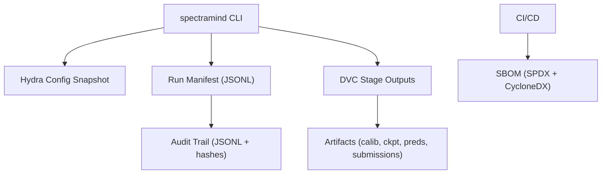

# ADR 0006 — Reproducibility Standards

* **Status:** ✅ Accepted
* **Date:** 2025-09-07
* **Project:** SpectraMind V50 — NeurIPS 2025 Ariel Data Challenge
* **Tags:** reproducibility, audit, lineage, compliance, sbom
* **Owners:** Reproducibility WG (Lead: Andy Barta), ML/Infra, Data Ops

---

## 1) Context

The Ariel Data Challenge requires **mission-grade reproducibility**:

* Kaggle runtime: no internet, ≤9h wallclock → pipeline must be deterministic & self-contained.
* Scientific credibility: reviewers demand **audit trails** (what config, what data, what commit).
* Compliance: need to prove **no hidden dependencies**, **no nondeterminism**, **secure packaging**.

Prior ad-hoc approaches (print logs, notebook checkpoints) are insufficient. We need **hard guarantees**.

---

## 2) Decision

Adopt a **multi-layer reproducibility standard**:

1. **Run manifests**

   * Every CLI invocation (`spectramind …`) emits a structured JSON/JSONL manifest.
   * Includes: timestamp, git commit, config hash, CUDA/parity info, seeds, artifacts.

2. **Config snapshots**

   * Hydra configs frozen per run to `artifacts/runs/<timestamp>/config.yaml`.
   * Hash digest (SHA256) logged in manifest.

3. **Artifact lineage (DVC)**

   * All stages (`calibrate → train → predict → submit`) declared in `dvc.yaml`.
   * `dvc.lock` proves reproducible lineage across datasets and models.

4. **Software Bill of Materials (SBOM)**

   * Every CI release generates SPDX + CycloneDX SBOM via Syft/Grype.
   * CI gates: fail if unknown deps, license conflicts, or CVEs.

5. **Determinism guardrails**

   * Enforce `torch.use_deterministic_algorithms(True)` and seed control.
   * Disable CuDNN benchmarking, TF32, and nondeterministic kernels (see ADR-0003).

---

## 3) Drivers

* **Scientific auditability** — reviewers must reproduce leaderboard runs exactly.
* **Safety** — prevent accidental nondeterminism in Kaggle runtime.
* **Transparency** — manifests + SBOM give short audit trails.
* **CI parity** — same configs and hashes prove reproducibility across local, CI, Kaggle.

---

## 4) Alternatives

| Option                                           | Pros                                | Cons                             |
| ------------------------------------------------ | ----------------------------------- | -------------------------------- |
| Notebook checkpoints (ad-hoc)                    | Easy                                | Fragile, unreproducible          |
| MLflow / experiment tracker                      | Nice UI                             | Too heavy, not Kaggle-safe       |
| Docker image pinning only                        | Portable                            | No fine-grained artifact lineage |
| **Chosen: JSONL manifests + Hydra + DVC + SBOM** | Lightweight, Kaggle-safe, auditable | Requires CI discipline           |

---

## 5) Architecture

---

## 6) Implementation Plan

1. **Run manifest**

   * `src/spectramind/config/snapshot.py` → auto-dump configs & env to JSONL.
   * Append per-stage logs to `artifacts/runs/events.jsonl`.

2. **Config snapshots**

   * Hydra save callback: dump YAML + hash.

3. **DVC pipeline**

   * Define `dvc.yaml` stages for calibrate/train/predict/submit.
   * CI enforces `dvc repro` succeeds and `dvc status` is clean.

4. **SBOM**

   * Add `.github/workflows/sbom-refresh.yml` (Syft/Grype).
   * Artifacts uploaded per release.

5. **CI compliance jobs**

   * Verify manifests, config snapshots, SBOM presence.

---

## 7) Risks & Mitigations

| Risk                                        | Mitigation                                      |
| ------------------------------------------- | ----------------------------------------------- |
| SBOM false positives                        | Curate ignore list; run weekly refresh          |
| Developer bypass (running scripts directly) | Pre-commit hook enforces `spectramind` CLI only |
| Kaggle time overhead (extra logging)        | Keep manifests lightweight (JSONL append only)  |
| Storage bloat (snapshots, manifests)        | Retention policy: keep last N runs per branch   |

---

## 8) Consequences

* ✅ Mission-grade reproducibility: every run auditable.
* ✅ Kaggle submissions provably tied to configs + git commit.
* ✅ Security posture improved (SBOM, CVE scan).
* ❌ Requires developer training on Hydra + DVC discipline.

---

## 9) Compliance Gates (CI)

* [ ] Run manifest (`events.jsonl`) exists after every stage.
* [ ] Config snapshot written with hash digest.
* [ ] `dvc status` clean, `dvc repro` succeeds.
* [ ] SBOM generated for each release.
* [ ] Determinism test job passes (same seed → same checksum).

---

## 10) References

* SpectraMind repo scaffold & production blueprint
* AI Research Notebook & Upgrade Guide
* Scientific context on calibration noise
* Recent Nature spectroscopy results (JWST CO₂/SO₂)
* ADR-0001 (Hydra+DVC), ADR-0003 (CI↔CUDA), ADR-0005 (CLI-First)

---
