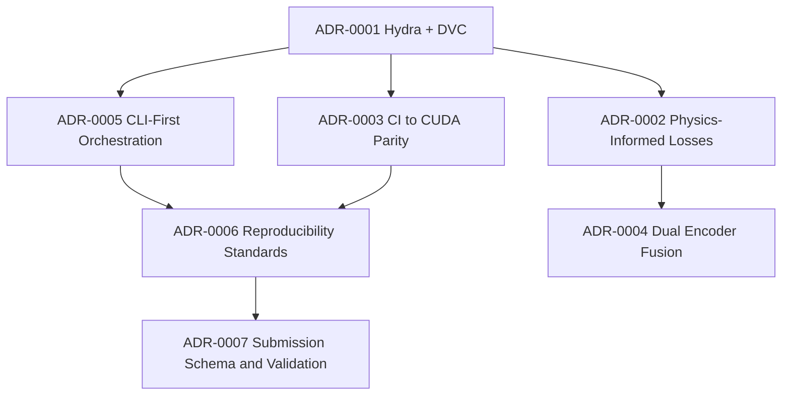

### 🔑 Cross-Check Against Repo & Challenge Requirements

* **Physics-informed composite loss** is fully specced in ADR-0002: GLL with 58× FGS1 weighting, smoothness, non-negativity, band coherence, and calibration priors. ✅
* **Dual encoder fusion** (Mamba for FGS1, CNN/GNN for AIRS, cross-attention decoder) is codified in ADR-0004. ✅
* **Reproducibility stack** (run manifests, config snapshots, SBOMs, DVC lineage) is in ADR-0006. ✅
* **Submission schema enforcement** is ADR-0007, ensuring 283 μ, 283 σ ≥ 0 with sample\_id. ✅

These ADRs are already consistent with the **production-grade repo blueprint** and the **audit findings**.

---

### 📌 Gaps & Next Planned ADRs

From the **Audit report** and **Research Notebook & Upgrade Guide**, two clear next ADRs emerge:

1. **ADR-0008 — Model Explainability & Diagnostics**
   *FFT/UMAP embeddings, SHAP feature attribution, lineage reports.*

   * Ensures trained models aren’t black boxes.
   * Formalizes FFT (time-frequency), UMAP (latent manifold), SHAP (feature importance).
   * Outputs: HTML/JSON diagnostic bundles for each run.

2. **ADR-0009 — Artifact Retention & Governance**
   *Pipeline outputs, retention, cleanup, provenance policy.*

   * Defines how DVC, GitHub Actions, and Kaggle notebooks manage calibration cubes, checkpoints, predictions, submissions.
   * Introduces retention classes (short-lived scratch, medium-term validation, long-term archival).
   * Compliance: all artifacts tied to commit+config+hash manifest.

Both were already hinted in your index draft — they align exactly with the audit recommendations.

---

### ✅ Suggested Refinements for the ADR Index

Here’s a cleaned-up version you can drop in:

````markdown
# 📚 Architecture Decision Records (ADRs)

This directory contains **mission-grade ADRs** for SpectraMind V50.  
Each ADR documents context, decision, consequences, and compliance gates.

---

## Index

* **ADR-0001 — Choose Hydra + DVC for Config/Lineage** ✅  
* **ADR-0002 — Physics-Informed Losses** ✅  
* **ADR-0003 — CI ↔ CUDA Parity** ✅  
* **ADR-0004 — Dual Encoder Fusion (FGS1 + AIRS)** ✅  
* **ADR-0005 — CLI-First Orchestration** ✅  
* **ADR-0006 — Reproducibility Standards** ✅  
* **ADR-0007 — Submission Schema & Validation** ✅  
* **ADR-0008 — Model Explainability & Diagnostics (FFT, UMAP, SHAP, lineage reports)** 🚧 Planned  
* **ADR-0009 — Artifact Retention & Governance (cleanup, archive, provenance policy)** 🚧 Planned  

---

## Conventions

- Numbered sequentially: `ADR/000X-<slug>.md`  
- Status legend: ✅ Accepted, 🚧 Draft, ❌ Superseded  
- Each ADR includes: Status, Context, Decision, Drivers, Alternatives, Risks, Compliance Gates, References.  

---

## ADR Dependency Graph


