# 🛰️ SpectraMind V50 — Architecture Overview (Upgraded)

Mission-grade, physics-informed, neuro-symbolic pipeline for the **NeurIPS 2025 Ariel Data Challenge**.
Performs **multi-sensor fusion** of FGS1 time-series + AIRS spectroscopy to produce **calibrated per-bin μ/σ** across **283 spectral channels**.

---

## 1) CLI-First Orchestration

All logic is exposed through a single, typed CLI with Hydra overrides—no hidden params.

**Entrypoint:** `spectramind` (Typer)

| Subcommand   | Purpose                              | Inputs                 | Outputs                          |
| ------------ | ------------------------------------ | ---------------------- | -------------------------------- |
| `calibrate`  | Raw telescope to calibrated cubes    | Raw FGS1, AIRS         | Calibrated tensors (DVC)         |
| `preprocess` | Binning, masks, alignment            | Calibrated tensors     | Physics-aligned packs            |
| `train`      | Dual encoders + heteroscedastic head | Packs, configs         | Checkpoints, metrics             |
| `predict`    | Inference                            | Checkpoint, eval split | μ/σ per bin (283), CSV           |
| `diagnose`   | Repro & debug tools                  | Run dir, logs          | FFT/UMAP plots, reports          |
| `submit`     | Package & validate                   | Predictions            | Kaggle-ready zip, schema-checked |

✅ Principle: **CLI + Hydra** everywhere; every param is discoverable and overridable.

---

## 2) Hydra Configuration System

**Config groups**:

* `env/` – runtime (local, Kaggle, HPC, CI)
* `data/` – ingestion, calibration, preprocessing
* `calib/` – ADC → dark → flat → CDS → photometry → trace → phase
* `model/` – encoders, fusion, decoder
* `training/` – optimizers, schedulers, precision, workers
* `loss/` – smoothness, non-negativity, coherence, uncertainty
* `logger/` – JSONL, tensorboard, wandb

✅ Guarantee: **One config = one reproducible experiment** (snapshotted + hashed versus schema).

---

## 3) Data Flow

```mermaid
flowchart TD
  A["Raw Inputs<br/>FGS1 + AIRS"]
  B["Calibration<br/>ADC → dark → flat → CDS → photometry → trace → phase"]
  C["Physics-aligned tensors<br/>(DVC-tracked)"]
  D["Encoders"]
  D1["FGS1 encoder<br/>State-Space (Mamba SSM)"]
  D2["AIRS encoder<br/>CNN or GNN (spectral)"]
  E["Fusion<br/>cross-modal alignment"]
  F["Decoder<br/>heteroscedastic μ, σ per bin (283)"]
  G["Submission<br/>CSV + schema validation"]

  A --> B --> C --> D
  D --> D1
  D --> D2
  D --> E --> F --> G
```

✅ Physics-aware: **temporal sync**, **smoothness priors**, **spectral coherence**.

---

## 4) Model Architecture

* **Dual encoders**

  * `fgs1_encoder.py` – denoise, bin, transit-aware sequencing
  * `airs_encoder.py` – wavelength-structured CNN/GNN
* **Fusion** – cross-attention or feature concat into a joint latent
* **Decoder** – heteroscedastic regression head (μ, σ per bin)
* **Constraints** – symbolic loss engine (non-negativity, smoothness, molecular coherence)

✅ Hybrid overlays: **symbolic + neural** for interpretability and leaderboard robustness.

---

## 5) Reproducibility & Lineage

* **DVC pipelines**: calibrate → preprocess → train → predict → submit
* **Event logs**: structured JSONL (`schemas/events.schema.json`)
* **Run manifests**: config hash + git commit + artifact digests
* **CI/CD**: Kaggle smoke tests, SBOM refresh, lint/type gates, determinism checks

✅ Every artifact, config, and run is **lineage-linked**.

---

## 6) Error Handling & UX

* Rich Typer CLI: autocompletion, colorized errors, typed exceptions
* Runtime guardrails: loud failures on mis-configs or missing inputs
* DVC fences: protect against long-running Kaggle jobs
* Pre-commit: lint, type, security, schema, and SBOM checks

---

## 7) Challenge Alignment

* ≤ 9 h runtime on Kaggle GPUs
* Offline-safe (no internet); bootstrap via `bin/kaggle-boot.sh`
* **283 spectral bins** enforced in schema
* μ/σ outputs carry calibrated uncertainty (heteroscedastic regression)

---

## ⚡ Summary

**SpectraMind V50** = clean, reproducible, symbolic+neural architecture.
CLI-first orchestration + Hydra configs + DVC lineage + dual-channel encoders deliver **scientific fidelity** and **competition performance** under Kaggle constraints.

---

### 📁 Commit-ready diagram source (for `assets/diagrams/pipeline.mmd`)

```mermaid
%% ------------------------------------------------------------------
%% SpectraMind V50 — End-to-End Pipeline (GitHub-compatible Mermaid)
%% File: assets/diagrams/pipeline.mmd
%% ------------------------------------------------------------------
flowchart TD
  classDef raw fill:#eef,stroke:#447,stroke-width:1px
  classDef stage fill:#efe,stroke:#474,stroke-width:1px
  classDef model fill:#ffe,stroke:#774,stroke-width:1px
  classDef out fill:#fee,stroke:#744,stroke-width:1px

  A["Raw Inputs<br/>FGS1 + AIRS"]:::raw
  B["Calibration<br/>ADC → dark → flat → CDS → photometry → trace → phase"]:::stage
  C["Physics-aligned tensors<br/>(DVC-tracked)"]:::stage
  D["Encoders"]:::model
  D1["FGS1 encoder<br/>Mamba SSM"]:::model
  D2["AIRS encoder<br/>CNN or GNN"]:::model
  E["Fusion<br/>cross-modal alignment"]:::model
  F["Decoder<br/>μ, σ per bin (283)"]:::model
  G["Submission<br/>CSV + schema validation"]:::out

  A --> B --> C --> D
  D --> D1
  D --> D2
  D --> E --> F --> G
```

> Tip: Avoid `|` pipes or stray Markdown just before or inside Mermaid blocks; keep labels short, use ` ` for line breaks, and prefer plain punctuation to prevent GitHub’s parser errors.
