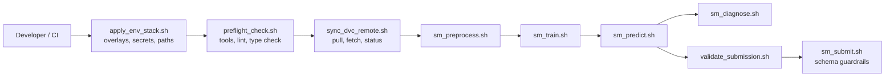
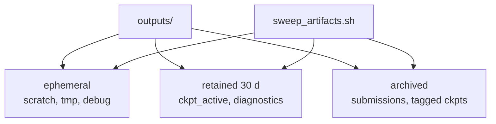
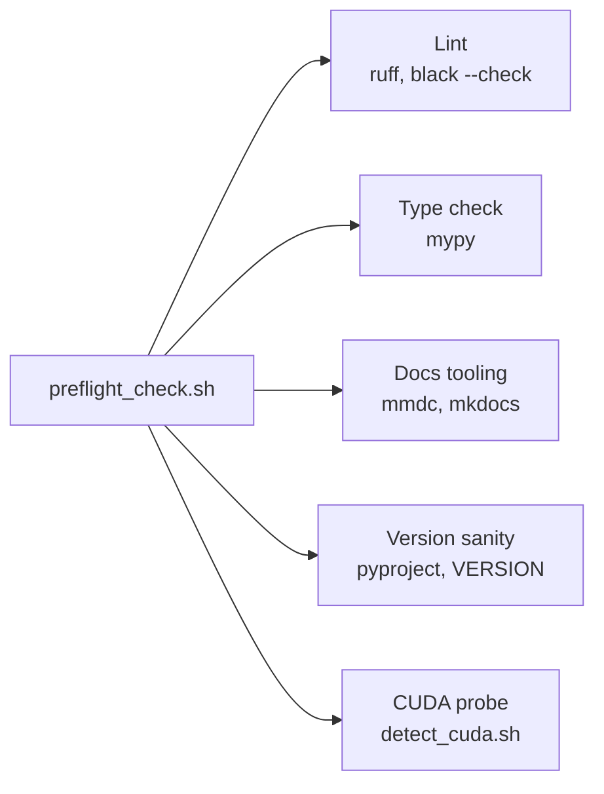

# 🛰️ SpectraMind V50 — `bin/` Architecture

Mission-grade command suite that powers local dev, CI, and Kaggle-safe operations.
All scripts are **idempotent**, **fail-fast**, and **repo-root aware**.

---

## 📦 Scope of `bin/`

* **Bootstrap & env**: `apply_env_stack.sh`, `ensure_repo_root.sh`, `detect_cuda.sh`
* **DVC orchestration**: `sync_dvc_remote.sh`, `sweep_artifacts.sh`, `gc_safe.sh`
* **Kaggle helpers**: `make_kaggle_bundle.sh`, `validate_submission.sh`
* **Run wrappers**: `sm_preprocess.sh`, `sm_train.sh`, `sm_predict.sh`, `sm_diagnose.sh`, `sm_submit.sh`
* **Release & safety**: `bump_version.sh`, `generate_sbom.sh`, `preflight_check.sh`
* **Docs & diagrams**: `render_mermaid.sh`, `render_docs.sh`

> Each script supports `-h|--help` and `--dry-run` where applicable.
> Scripts write structured logs to `outputs/logs/*.jsonl` when `SM_JSONL=1`.

---

## 🔧 Directory Contract

```text
bin/
├─ apply_env_stack.sh         # compose env overlays (local/kaggle/ci)
├─ ensure_repo_root.sh        # guard: run from repo root; cd as needed
├─ detect_cuda.sh             # detect GPU; export SM_HAS_CUDA
├─ preflight_check.sh         # lint, type, tooling presence
├─ sync_dvc_remote.sh         # pull/fetch/status; lock-safe; offline-aware
├─ sweep_artifacts.sh         # enforce ADR-0009 retention windows
├─ make_kaggle_bundle.sh      # pack src+configs+assets to /outputs/bundle.zip
├─ validate_submission.sh     # CSV schema check; header/order; nonnegativity
├─ sm_preprocess.sh           # wrapper for spectramind preprocess
├─ sm_train.sh                # wrapper for spectramind train
├─ sm_predict.sh              # wrapper for spectramind predict
├─ sm_diagnose.sh             # wrapper for spectramind diagnose
├─ sm_submit.sh               # wrapper for spectramind submission flow
├─ bump_version.sh            # semver bump + tags
├─ generate_sbom.sh           # SPDX/CycloneDX via syft/grype
├─ render_mermaid.sh          # mmd → svg/png for docs
└─ render_docs.sh             # MkDocs build, link check
```

---

## 🧭 Execution Topology



---

## 🚀 One-Shot Recipes

### Local fast smoke (CPU)

```bash
./bin/apply_env_stack.sh --preset local
./bin/preflight_check.sh --quick
./bin/sm_preprocess.sh +preset=fast
./bin/sm_train.sh +defaults='[/profiles/ci]'
./bin/sm_predict.sh data.split=val
./bin/sm_diagnose.sh --report ./outputs/reports/last_run
```

### Kaggle bundle (offline-safe)

```bash
./bin/apply_env_stack.sh --preset kaggle
./bin/make_kaggle_bundle.sh --out ./outputs/bundles/sm_v50_bundle.zip
```

### DVC sync (pull only; no push on Kaggle)

```bash
# Local developer
./bin/sync_dvc_remote.sh --pull --remote origin --jobs 8

# Kaggle runner (auto offline mode)
./bin/sync_dvc_remote.sh --status
```

---

## 🛡️ Safety & Idempotency

* **Shell strictness**: scripts use `set -Eeuo pipefail` and trap with line numbers.
* **Locking**: concurrency-safe via `flock` on DVC operations and sweeps.
* **Offline awareness**: Kaggle preset disables `push/gc` and network-heavy steps.
* **JSONL audit**: set `SM_JSONL=1` to emit machine-readable event logs.

---

## 🗂️ Artifact Governance (ADR-0009)



* **Ephemeral**: removed aggressively by `sweep_artifacts.sh`.
* **Retained (30 d)**: current checkpoints, latest diagnostics.
* **Archived**: immutable, referenced by tags and DVC pinning.

---

## ✅ Submission Guardrails

* **Schema**: `validate_submission.sh` checks Frictionless Table Schema and exact header order (`sample_id`, `mu_000..mu_282`, `sigma_000..sigma_282`).
* **Physics sanity**: nonnegativity, optional monotonic segments, value ranges.
* **Deterministic CSV**: stable float formatting, newline discipline `\n`.

**Example**

```bash
./bin/validate_submission.sh ./outputs/submissions/sm_v50.csv
```

---

## 🧩 Script Interfaces (Essentials)

### `sync_dvc_remote.sh`

* **Usage**: `--status | --pull | --fetch | --list-remotes [--remote NAME] [--jobs N] [--dry-run]`
* **Env**: `DVC_REMOTE`, `DVC_JOBS`, `DVC_DRY_RUN=1`, `DVC_JSON=1`

### `sm_train.sh`

* **Proxy to**: `python -m spectramind train ...`
* **Pass-through**: any Hydra overrides (`+defaults=`, `model=`, `loss.*`, `data.*`, `trainer.*`)
* **Shortcuts**: `--ci` maps to `+defaults='[/profiles/ci]'`

### `make_kaggle_bundle.sh`

* **Packs**: `src/`, `configs/`, `assets/diagrams/`, minimal `requirements.txt`, runner notebook/script, license.
* **Excludes**: `.git/`, large assets, private keys.

---

## 🔍 Preflight Contract



* Fails fast with actionable messages; exits non-zero on any gate failure.

---

## 🧪 Determinism & Reproducibility

* **Seeds**: exported by wrappers; logged to JSONL.
* **Hydra snapshots**: saved per run; `sm_*` wrappers capture resolved configs.
* **DVC content-hashing**: artifacts fetched by hash, not path.
* **Profiles**: `ci`, `kaggle_gpu`, `local` overlays ensure stable runtime.

---

## 🧰 Troubleshooting Cheats

* Mermaid fails in GitHub?

  * Remove `|` from labels, use `<br/>` for line breaks, keep IDs simple (`A`, `B1`).
* DVC “no remote configured”?

  * `dvc remote list`; then `dvc remote add -d origin s3://...` (or set `DVC_REMOTE` env).
* Kaggle memory errors?

  * Use `+defaults='[/profiles/ci]'`, reduce `trainer.accumulate_grad_batches`, limit dataloader workers.

---

## 🔒 Conventions

* Scripts are POSIX-ish and portable across macOS/Linux (BSD/GNU `sed` guarded).
* All external tools (DVC, mmdc, syft, grype) are probed in `preflight_check.sh`.
* Return codes are meaningful; wrappers never swallow failures.

---

## 🗺️ Future Add-Ons

* `sm_ablate.sh` for automatic ablation matrices.
* `sm_explain.sh` for batch SHAP/FFT analyses.
* `push_release_artifacts.sh` to publish bundles to GitHub Releases.

---

**End of file**
