# 🧭 SpectraMind V50 — Architecture Document

Mission-grade repository for the **NeurIPS 2025 Ariel Data Challenge**.
SpectraMind V50 is a **physics-informed, neuro-symbolic pipeline** that extracts exoplanet transmission spectra (μ, σ across 283 bins) from **FGS1 photometry** and **AIRS spectroscopy**.

---

## 1. Scientific Motivation

* **Transit spectroscopy**: starlight filtered through a planet’s atmosphere encodes molecular fingerprints (H₂O, CO₂, SO₂, CH₄, …).
* **Challenge dataset**: simulated ESA **Ariel** mission data — dual sensors:

  * **FGS1**: broadband white-light photometer → anchors global transit depth.
  * **AIRS**: 283-channel IR spectrometer → captures wavelength-dependent absorption.
* **Noise sources**: spacecraft jitter, thermal drift, detector nonlinearity.
* **Evaluation metric**: Gaussian Log-Likelihood (GLL), with FGS1 bin weighted \~58×.

---

## 2. Design Philosophy

* **NASA-grade standards**: modularity, reproducibility, automation.
* **CLI-first orchestration**: Typer + Hydra → all pipeline stages reproducible by config.
* **Physics-informed AI**: symbolic loss terms (smoothness, non-negativity, calibration priors).
* **Neuro-symbolic architecture**: dual encoders (FGS1 + AIRS) fused via cross-attention.
* **MLOps rigor**: DVC versioning, GitHub Actions CI, Kaggle-ready packaging.

---

## 3. Repository Structure

```text
spectramind-v50/
├── configs/          # Hydra configs: data, model, training, loss, submission
├── src/spectramind/  # Source: cli/, calib/, models/, pipeline/, diagnostics/
├── schemas/          # JSON schemas (submission, events, config snapshots)
├── tests/            # Unit + integration tests (incl. CLI + Kaggle guardrails)
├── data/             # Raw/interim/processed (DVC-tracked)
├── docs/             # MkDocs site, guides, diagrams (pipeline.mmd, architecture.mmd)
├── .github/workflows # CI/CD: ci.yml, kaggle_notebook_ci.yml, sbom-refresh.yml
├── scripts/          # run_pipeline.sh, kaggle_submit.sh, bump_version.sh
├── bin/              # Kaggle bootstraps, selftests, sync_dvc_remote.sh
├── Dockerfile        # GPU-ready reproducible container
└── dvc.yaml          # Calibrate → Preprocess → Train → Predict → Diagnose → Submit
```

Each directory has **single responsibility** (e.g. `src/models/` only model defs, `src/pipeline/` only calibration & preprocessing logic).

---

## 4. Pipeline Overview

```mermaid
flowchart LR
  A["User / CI"] --> B["spectramind CLI<br/>(Typer + Hydra)"]
  B --> C["Configs YAML"]
  C --> D["Calibrate<br/>FGS1 & AIRS → cubes"]
  D --> E["Encoders<br/>FGS1 = Mamba SSM<br/>AIRS = CNN/GNN"]
  E --> F["Decoder<br/>μ, σ (heteroscedastic head)"]
  F --> G["Diagnostics<br/>GLL, FFT, UMAP, SHAP, checks"]
  G --> H["Submission<br/>CSV + manifest + schema validate"]
  H --> I["Kaggle Leaderboard"]

  %% Artifacts
  D -.-> J["DVC-tracked calibrated data"]
  E -.-> J
  G -.-> J["HTML reports + metrics"]
  H -.-> J["submission.zip"]

```



---

## 5. Model Architecture

* **Dual encoders**:

  * *FGS1*: time-series state-space model (Mamba SSM).
  * *AIRS*: graph/CNN hybrid capturing spectral correlations.
* **Fusion**: cross-attention → aligns photometric baseline with spectral features.
* **Decoder**: heteroscedastic regression head → μ (mean) & σ (uncertainty).
* **Loss**: composite physics-informed:

  * Gaussian log-likelihood (FGS1 bin weighted).
  * Smoothness (discourage jagged spectra).
  * Non-negativity (depths ≥ 0).
  * Band coherence (adjacent bins correlated).
  * Calibration priors (instrument physics).

---

## 6. Diagnostics & Validation

* **Numerical metrics**: GLL, MSE, residual histograms.
* **Sanity checks**: non-negative depths, σ > 0, boundedness (0–1).
* **Spectral analysis**: FFT (periodicity), UMAP/t-SNE embeddings.
* **Interpretability**: SHAP feature attributions.
* **Reports**: HTML summaries with inline plots.

---

## 7. CI/CD & Reproducibility

* **GitHub Actions**: linting, tests, SBOM generation, artifact sweeping.
* **DVC pipeline**: cache reuse across calibrate/preprocess/train/predict.
* **Kaggle integration**: `requirements-kaggle.txt`, `kaggle_submit.sh`, offline DVC fallback.
* **Versioning**: `VERSION`, `CHANGELOG.md` (Keep-a-Changelog + SemVer).
* **Security**: CodeQL, Bandit, pip-audit; SBOM (CycloneDX/SPDX).

---

## 8. Extensibility & Roadmap

* Add **alternative encoders** (transformers, diffusion).
* Expand **physics priors** (molecular line databases, radiative transfer constraints).
* Introduce **active learning**: prioritizing uncertain samples.
* Optional **server/GUI** (`src/server/`): FastAPI/Streamlit dashboard for interactive diagnostics.

---
