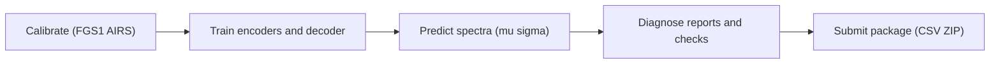

# 🚀 Quickstart — SpectraMind V50

Welcome to **SpectraMind V50**, the mission-grade, physics-informed pipeline for the  
[NeurIPS 2025 Ariel Data Challenge](https://www.ralspace.stfc.ac.uk/Pages/ariel-data-challenge-2024.aspx).

This guide helps you **get running quickly** on local dev, Kaggle kernels, or CI.

---

## 1. 📦 Install & Setup

Clone and set up your environment:

```bash
git clone https://github.com/your-org/spectramind-v50.git
cd spectramind-v50
make dev   # installs venv, pre-commit hooks, dev deps
````

Verify:

```bash
pre-commit run --all-files
pytest -q
```

✅ All hooks/tests should pass.

---

## 2. 🧭 Core CLI Workflow

All commands run via the unified **`spectramind`** CLI:

```bash
spectramind calibrate --config-name train +calib=nominal +env=local
spectramind train     --config-name train +model=v50
spectramind predict   --config-name predict
spectramind diagnose  --config-name diagnose
spectramind submit    --config-name submit
```

Stages:

1. **calibrate** → raw → calibrated cubes
2. **train** → dual encoders + decoder
3. **predict** → model checkpoint → predictions CSV
4. **diagnose** → error analysis, FFT/UMAP, visual checks
5. **submit** → package into Kaggle-ready `submission.zip`

---

## 3. 📊 Pipeline Flow (Mermaid Diagram)



*Note: Decoder outputs \$\mu, \sigma\$ across 283 spectral bins.*

---

## 4. 📂 Repo Layout (Essentials)

```text
spectramind-v50/
├─ src/spectramind/         # CLI + pipeline code
├─ configs/                 # Hydra configs (env, data, calib, model, loss, logger…)
├─ schemas/                 # JSON Schemas for submission/events/config snapshots
├─ notebooks/               # Exploration, binning, ablations, error analysis
├─ artifacts/               # Model checkpoints, submissions, reports
├─ data/                    # Raw/interim/processed (DVC-tracked)
├─ .github/workflows/       # CI/CD (lint, test, docs, Kaggle, release)
```

For full tree, see [ARCHITECTURE.md](../ARCHITECTURE.md).

---

## 5. 🛡️ Kaggle Usage

On Kaggle kernels:

1. Attach the **competition dataset** (`neurips-2025-ariel-data-challenge`).
2. Attach your exported **SpectraMind V50 Dataset** (code + `requirements-kaggle.txt`).
3. Open [`kaggle/notebook_template.ipynb`](../../kaggle/notebook_template.ipynb).
4. Run → generates:

   * `outputs/config_snapshot.json`
   * `outputs/submission.csv`
   * `submission.zip` (ready to upload)

⚠️ No internet is allowed. Dependencies must be pre-pinned in `requirements-kaggle.txt`.

---

## 6. 🔬 CI/CD & Reproducibility

* **CI**: Lint, tests, SBOM, security scans via GitHub Actions.
* **DVC**: Tracks data lineage (`raw → calibrated → processed`).
* **Hydra**: Manages config snapshots, logged under `artifacts/`.
* **JSONL events**: Every CLI run emits structured logs (`events.jsonl`).

---

## 7. 📊 Next Steps

* Explore raw data: [`00_exploration.ipynb`](../../notebooks/00_exploration.ipynb).
* Try alignment/binning: [`10_alignment_and_binning.ipynb`](../../notebooks/10_alignment_and_binning.ipynb).
* Run error analysis: [`30_error_analysis.ipynb`](../../notebooks/30_error_analysis.ipynb).
* Read [Architecture Overview](../ARCHITECTURE.md).

---

## ✅ TL;DR

```bash
make dev
spectramind calibrate --config-name train
spectramind train --config-name train
spectramind predict --config-name predict
spectramind submit --config-name submit
```

🎯 You now have a Kaggle-ready `submission.zip` under `artifacts/`.

---
