# 🛰️ SpectraMind V50 — Architecture

Mission-grade, CLI-first, Hydra-driven, DVC-tracked, Kaggle-ready repository.
Physics-informed, neuro-symbolic pipeline for **multi-sensor fusion** (FGS1 + AIRS) producing calibrated μ/σ over **283 spectral bins**.

---

## 📦 High-Level Design

The repository implements a **modular pipeline**:

```mermaid
flowchart TD
  A["Raw Inputs<br/>FGS1 (photometry) + AIRS (spectroscopy)"]:::raw
  B["Calibration<br/>(ADC, dark, flat, trace, phase, photometry)"]:::stage
  C["Preprocessing<br/>tensor packs, binning, masks"]:::stage
  D["Encoders<br/>FGS1 = SSM (Mamba)<br/>AIRS = CNN/GNN"]:::model
  E["Fusion Decoder<br/>cross-attention → μ,σ (283 bins)"]:::model
  F["Diagnostics<br/>GLL, FFT, UMAP, physics checks"]:::stage
  G["Submission<br/>validated CSV/ZIP"]:::out
  H["Kaggle Leaderboard"]:::out

  A --> B --> C --> D --> E --> F --> G --> H

  classDef raw fill:#f9f,stroke:#333,stroke-width:1px;
  classDef stage fill:#bbf,stroke:#333,stroke-width:1px;
  classDef model fill:#bfb,stroke:#333,stroke-width:1px;
  classDef out fill:#ffb,stroke:#333,stroke-width:1px;
```



> **Note**: The diagram uses standard GitHub-supported Mermaid (`flowchart TD`) and HTML line breaks (`<br/>`) for compact labels.

---

## 🧩 Core Modules

### 1) CLI Layer

* Single entry point: `spectramind` (Typer app).
* Subcommands: `calibrate`, `preprocess`, `train`, `predict`, `diagnose`, `submit`.
* UX: shell autocompletion, rich error handling, JSONL event logs.

### 2) Configuration

* **Hydra** config groups (`configs/`) power all stages:

  * `env/`, `data/`, `calib/`, `model/`, `training/`, `loss/`, `logger/`.
* **Snapshots**: full config capture → validated against `schemas/config_snapshot.schema.json`.

### 3) Calibration (`src/spectramind/calib/`)

* Stages: `adc`, `dark`, `flat`, `cds`, `trace`, `phase`, `photometry`.
* NaN-safe, Torch-first (NumPy fallbacks).
* Outputs: calibrated data cubes with propagated variance.

### 4) Preprocessing

* Packs features into tensors `[B, T, C]` with masks and bin indices.
* Independent DVC stage (decoupled from calibration for faster iteration).

### 5) Model (`src/spectramind/models/`)

* **FGS1 encoder**: Structured State-Space (Mamba).
* **AIRS encoder**: CNN/GNN spectral extractor.
* **Fusion decoder**: cross-attention aligning FGS1 timing with AIRS features.
* Output: heteroscedastic **μ** and **σ** (283 wavelength bins).

### 6) Losses

* Composite **Physics-Informed Loss**:

  * Gaussian log-likelihood (**FGS1 ×58** per metric spec).
  * Smoothness, non-negativity, band coherence, calibration penalties.

### 7) Diagnostics (`src/spectramind/diagnostics/`)

* GLL scoring, residual stats, FFT/UMAP projections.
* Physics checks: non-negativity, bounded depths, σ > 0.
* Export: HTML/JSONL/CSV reports.

### 8) Submission

* Validators enforce `schemas/submission.schema.json`.
* Packaged as Kaggle-safe CSV/ZIP.

---

## 📂 Repository Layout

```
spectramind-v50/
├─ configs/            # Hydra configs
├─ schemas/            # JSON Schemas (submission, events, config_snapshot)
├─ scripts/            # CLI helpers (bump_version.sh, kaggle_submit.sh, etc.)
├─ src/spectramind/    # Core package (cli, calib, models, diagnostics, train, submit)
├─ notebooks/          # Experiments (ablation, error analysis, submission check)
├─ docs/               # MkDocs site (guides, diagrams, ARCHITECTURE.md)
└─ .github/workflows/  # CI/CD (lint, tests, Kaggle, SBOM, docs)
```

---

## 🔄 Data & Reproducibility

* **DVC pipeline** (`dvc.yaml`): `calibrate → preprocess → train → predict → diagnose → submit`.
* Stages cache outputs; re-run only when inputs/configs change.
* **Lineage**: `raw → interim → processed → tensors`.

---

## 🧪 Scientific Guardrails

* Smoothness & coherence → avoid jagged/unphysical spectra.
* Non-negativity & boundedness → transit depths ∈ \[0, 1].
* Honest uncertainty calibration → **σ strictly > 0**.
* **FGS1 anchor** → absolute transit depth remains aligned.

---

## 📊 CI/CD & Validation

* **Pre-commit**: ruff, black, isort, mypy, bandit, detect-secrets.
* **CI**: lint/tests, Kaggle workflow checks, artifact sweeps, SBOM refresh, docs build.
* **Kaggle runtime**: `bin/kaggle-boot.sh` for optional local wheel installs; configs guard GPU use.

---

## 🌌 Scientific Context

* Aimed at ESA’s **Ariel** (launch \~2029), targeting 1,000+ exoplanets.
* Informed by JWST results (e.g., CO₂, SO₂, H₂O detections).
* Objective: **reproducible, physics-credible spectra** ready for scientific review.

---

### Changelog Notes (this revision)

* Kept the **Mermaid** diagram **exactly as provided** to preserve GitHub compatibility.
* Clarified module summaries and constraints.
* Tightened wording; no changes to diagram syntax or classDefs.

---
