# 🛰️ SpectraMind V50 — Architecture

Mission-grade, CLI-first, Hydra-driven, DVC-tracked, Kaggle-ready repository.
Physics-informed, neuro-symbolic pipeline for **multi-sensor fusion** (FGS1 + AIRS) producing calibrated μ/σ over 283 spectral bins.

---

## 📦 High-Level Design

The repository implements a **modular pipeline**:

```mermaid
flowchart TD
  A["Raw Inputs<br/>FGS1 (photometry) + AIRS (spectroscopy)"]:::raw
  B["Calibration<br/>(ADC, dark, flat, trace, phase, photometry)"]:::stage
  C["Preprocessing<br/>tensor packs, binning, masks"]:::stage
  D["Encoders<br/>FGS1 = SSM (Mamba)<br/>AIRS = CNN/GNN"]:::model
  E["Fusion Decoder<br/>cross-attention → μ,σ (283 bins)"]:::model
  F["Diagnostics<br/>GLL, FFT, UMAP, physics checks"]:::stage
  G["Submission<br/>validated CSV/ZIP"]:::out
  H["Kaggle Leaderboard"]:::out

  A --> B --> C --> D --> E --> F --> G --> H

  classDef raw fill:#f9f,stroke:#333,stroke-width:1px;
  classDef stage fill:#bbf,stroke:#333,stroke-width:1px;
  classDef model fill:#bfb,stroke:#333,stroke-width:1px;
  classDef out fill:#ffb,stroke:#333,stroke-width:1px;
```



---

## 🧩 Core Modules

### 1. **CLI Layer**

* Single entrypoint: `spectramind` (`Typer` app).
* Subcommands: `calibrate`, `preprocess`, `train`, `predict`, `diagnose`, `submit`.
* Features: shell autocompletion, rich error handling, JSONL event logs.

### 2. **Configuration**

* **Hydra** config groups (`configs/`) drive all stages:

  * `env/`, `data/`, `calib/`, `model/`, `training/`, `loss/`, `logger/`.
* **Snapshots**: configs hashed → `schemas/config_snapshot.schema.json`.

### 3. **Calibration (`src/spectramind/calib/`)**

* Modules: `adc`, `dark`, `flat`, `cds`, `trace`, `phase`, `photometry`.
* All NaN-safe, Torch-first, with NumPy fallbacks.
* Outputs: calibrated data cubes with variance propagation.

### 4. **Preprocessing**

* Feature packing into tensors `[B, T, C]` with masks.
* Independent DVC stage (decoupled from calibration).

### 5. **Model (`src/spectramind/models/`)**

* **FGS1 encoder**: Structured State-Space Model (Mamba).
* **AIRS encoder**: CNN/GNN spectral extractor.
* **Fusion decoder**: cross-attention block aligning FGS1 timing with AIRS features.
* Output: μ and σ (heteroscedastic).

### 6. **Losses**

* Composite Physics-Informed Loss:

  * Gaussian log-likelihood (FGS1 ×58).
  * Smoothness, non-negativity, band coherence, calibration penalties.

### 7. **Diagnostics (`src/spectramind/diagnostics/`)**

* GLL scoring, residual stats, FFT/UMAP projections.
* Physics checks: non-negativity, bounded depths, σ>0.
* HTML/JSONL report export.

### 8. **Submission**

* Validators check against `schemas/submission.schema.json`.
* Packaged as Kaggle-safe CSV/ZIP.

---

## 📂 Repository Layout

```
spectramind-v50/
├─ configs/            # Hydra configs
├─ schemas/            # JSON Schemas (submission, events, config_snapshot)
├─ scripts/            # CLI helpers (bump_version.sh, kaggle_submit.sh, etc.)
├─ src/spectramind/    # Core package (cli, calib, models, diagnostics, train, submit)
├─ notebooks/          # Experiments (ablation, error analysis, submission check)
├─ docs/               # MkDocs site (guides, diagrams, ARCHITECTURE.md)
└─ .github/workflows/  # CI/CD (lint, tests, Kaggle, SBOM, docs)
```

---

## 🔄 Data & Reproducibility

* **DVC pipeline** (`dvc.yaml`) defines stages: `calibrate → preprocess → train → predict → diagnose → submit`.
* Each stage caches outputs; reruns only if inputs/configs change.
* **Data lineage**: raw → interim → processed → model-ready tensors.

---

## 🧪 Scientific Guardrails

* Smoothness + coherence constraints → prevent jagged/unphysical spectra.
* Non-negativity + boundedness → transit depths ∈ \[0,1].
* Honest uncertainty calibration → σ strictly >0.
* FGS1 bin anchor → absolute transit depth always aligned.

---

## 📊 CI/CD & Validation

* **Pre-commit**: ruff, black, isort, mypy, bandit, secrets.
* **CI**: GitHub Actions run lint/tests, Kaggle CI, artifact sweeps, SBOM refresh.
* **Kaggle runtime**: `bin/kaggle-boot.sh` installs deps + PyG; configs guard GPU use.

---

## 🌌 Scientific Context

* Designed for ESA’s **Ariel mission** (launch \~2029) targeting 1,000+ exoplanets.
* Anchored in recent JWST/ERA discoveries: CO₂, SO₂, H₂O detection.
* Goal: reproducible, physics-credible spectra ready for science council validation.

---
