# SpectraMind V50 — NeurIPS 2025 Ariel Data Challenge

Mission-grade, CLI-first, Hydra-driven, DVC-tracked, Kaggle-ready repository.  
Physics-informed, neuro-symbolic pipeline for **multi-sensor fusion** (FGS1 + AIRS) producing calibrated μ/σ over 283 spectral bins.

---

## 🚀 Quickstart

```bash
# 1. Install dev environment
make dev

# 2. Run pipeline (example: local config)
spectramind calibrate --config-name train +calib=nominal +env=local
spectramind train     --config-name train +model=v50
spectramind predict   --config-name predict
spectramind submit    --config-name submit
````

All stages are **reproducible and Kaggle-safe** (no internet calls during pipeline execution).

---

## 📂 Repository Layout

```text
spectramind-v50/
├─ configs/           # Hydra config groups (env, data, calib, model, training, loss, logger)
├─ data/              # DVC-tracked datasets (raw → interim → processed)
├─ schemas/           # JSON Schemas (submission, events, config_snapshot)
├─ scripts/           # Pipeline scripts (package_submission.sh, kaggle_submit.sh, etc.)
├─ src/spectramind/   # Core Python package (cli, pipeline, models, inference, reports)
├─ notebooks/         # Experiments (e.g., ablations, submission checks)
├─ docs/              # MkDocs site (guides, diagrams, index.md)
└─ .github/workflows/ # CI/CD (lint, tests, Kaggle CI, SBOM, release)
```

👉 See [ARCHITECTURE.md](../ARCHITECTURE.md) for the detailed module design.

---

## 🛠️ Features

* **Unified CLI** via Typer (`spectramind`) with autocompletion and rich error reporting.
* **Hydra configs** for reproducible experiment composition.
* **DVC pipeline**: `calibrate → train → predict → submit` with full lineage.
* **Dual-channel modeling**:

  * **FGS1 encoder** (time-series; Structured SSM / Mamba).
  * **AIRS encoder** (spectral; CNN/GNN).
  * Fused decoder outputs per-bin μ/σ.
* **Physics-informed constraints**: smoothness, non-negativity, molecular priors.
* **JSONL event logging** for every run (see `schemas/events.schema.json`).
* **Kaggle-ready artifacts**: validated against `submission.schema.json`.

---

## 📊 Diagrams

### Pipeline Overview

```mermaid
flowchart LR
  RAW["FGS1 / AIRS Raw Inputs"]:::raw
  CAL["Calibration Chain"]:::stage
  ENC_FGS1["FGS1 Encoder (SSM)"]:::model
  ENC_AIRS["AIRS Encoder (CNN/GNN)"]:::model
  DEC["Fusion Decoder → μ/σ (283 bins)"]:::model
  SUB["Submission (CSV/ZIP)"]:::out

  RAW --> CAL --> ENC_FGS1
  CAL --> ENC_AIRS
  ENC_FGS1 --> DEC
  ENC_AIRS --> DEC
  DEC --> SUB

  classDef raw fill:#f9f,stroke:#333,stroke-width:1px;
  classDef stage fill:#bbf,stroke:#333,stroke-width:1px;
  classDef model fill:#bfb,stroke:#333,stroke-width:1px;
  classDef out fill:#ffb,stroke:#333,stroke-width:1px;
```



---

## 📚 Documentation Map

* [Quickstart Guide](guides/quickstart.md)
* [Hydra Configs](guides/hydra.md)
* [DVC Pipelines](guides/dvc.md)
* [Kaggle Integration](guides/kaggle.md)
* [Architecture](../ARCHITECTURE.md)
* [Contributing](../CONTRIBUTING.md)

---

## 📜 License

Released under the MIT License. See [LICENSE](../LICENSE).

```
